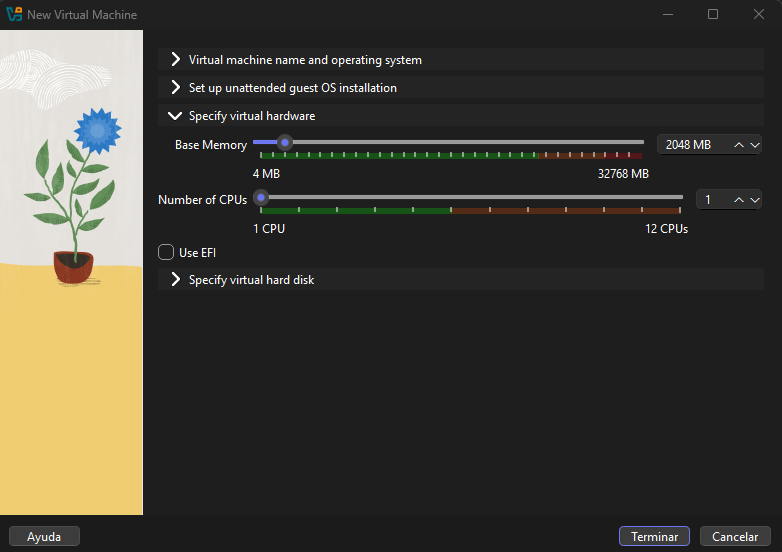
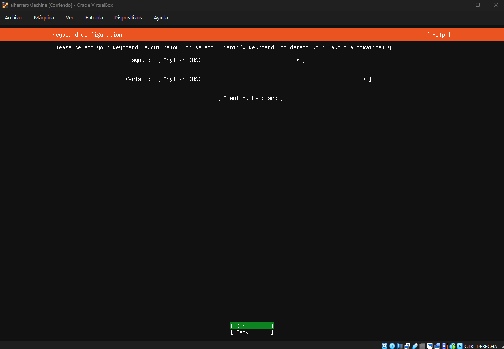
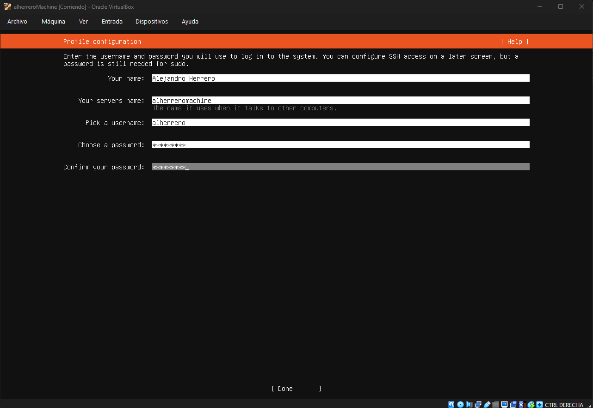
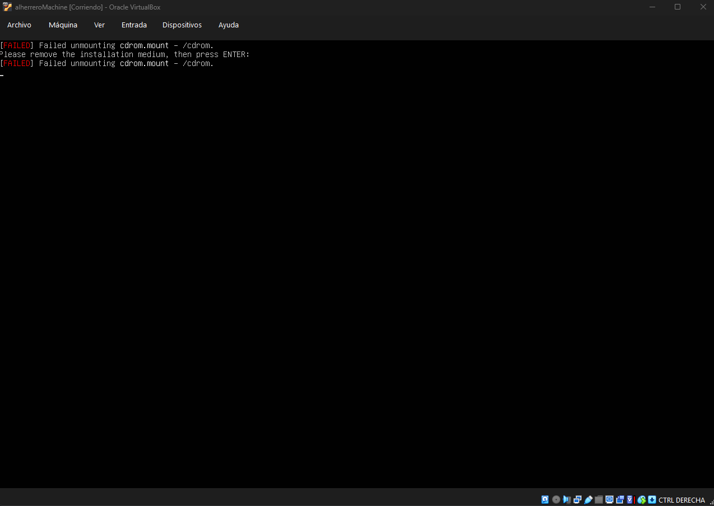

## Introducción
El dia de hoy veremos como crear desde 0 una maquina vulnerable. Esta guia te servira para poder crear tus propias maquinas y poder subirlas a diferentes plataformas como hackthebox, vulnyx, etc.

Antes de empezar a hacer el laboratorio, os recomiendo que tengais claro una idea general de como va a ser la maquina (Tematica, usuarios, intrusión, escalada).

## Instalar ubuntu server
Vamos a comenzar la creación de nuestra maquina descargando la ISO oficial de ubuntu server. 
-> https://ubuntu.com/download/server

Una vez con la ISO descargada, vamos a crear una maquina virtual, en mi caso en virtualbox.

Ponemos el nombre de la maquina y la imagen ISO de ubuntu server que previamente descargamos, y lo demas lo dejamos todo como esta excepto la casilla que pone "Procceed with Unattended Installation", es importante que la desmarqueis 


Aquí debemos asignarle recursos a la maquina, yo os recomiendo dejarlo tal cual como esta 2048mb y 1 CPU, si vuestra maquina requiere mas potencia la podeis poner sin problema


Finalmente vamos a asignarle 10Gb a la maquina. Es MUY importante que si quereis subir esta maquina a HackTheBox no paseís de los 10Gb, de lo contrario no os aceptarán la maquina, pero si necesitais pasaros de ese limite por cualquier cosa, debeis contactar con el staff de hackthebox.


Ya con todo configurado, arrancamos la maquina virtual


Despues de unos segundos, se habra cargado el instalador de ubuntu server. Para podernos mover por el instalador hacemos uso de las flechas del teclado y de la tecla enter. Ahora debemos seleccionar el idioma ingles, ya que es el lenguaje universal y las maquinas deben tener este idioma


Lo mismo hacemos con el teclado


Aquí dejaremos marcada la opción por defecto que es la de ubuntu Server normal


En al configuración de la red dejaremos como viene por defecto


El campo de Proxy address lo dejaremos vacio


Al detectarme que estoy en españa me ha asignado los mirrors de españa, en caso de que no os lo detecte podeís indicarle vosotros mismos el mirror que queraís tener, os dejo la lista de mirrors para todos los paises
-> https://launchpad.net/ubuntu/+archivemirrors


Ahora tenemos que elegir el disco donde se va a instalar ubuntu server, por defecto ya viene marcado el disco que hemos creado antes de vbox, así que usamos las flechas del teclado para ir hacia el boton de donde y le damos enter


Nos dara un resumen de lo que hemos configurado y simplemete tendremos que darle enter.


Ahora toca configurar un usuario, en mi caso para mi maquina tengo pensado que haya 2 usuarios `alherrero` y `root`. Luego mas tarde podemos cambiar y agregar nuevos usuarios, asi que no os comais mucho la cabeza con esto. Tambien nos pedira un `hostname`, el cual pondremos el nombre de nuestra maquina, no os precupeis si no teneis claro el nombre todavia, ya que luego lo podreis cambiar mas adelante


Nos preguntara que si queremos activar ubuntu pro, por defecto viene marcado que no, pero si no, marcar `Skip for now`


Despues nos pedira si queremos instalar en servicio OpenSSH, os recomiendo encarezidamente que lo instaleis, ya que nos permitira acceder a la maquina desde nuestra maquina, y asi poder administrar la maquina de forma mas comoda


Ahora nos pedira si queremos instalar algun snap, no marqueis ninguno, esto no nos hara falta para crear nuestra maquina


Fianalmente se empezara a instalar el sistema, debemos esperar unos pocos minutos


Una vez termine le damos a `Reboot now`


Nos saldra este error, es normal, le damos enter y la maquina se reiniciara


Y ubuntu server instalado 🎉


### Conectarse a la maquina mediante SSH
Como ya dije antes, para una mejor experiencia configurando la maquina, podeis usar vuestra maquina anfitrión o una vm con un entorno mas comodo. Para conectarnos es necesario que hayamos instalado el servicio SSH y tener en la configuracion de la maquina virtual la red puesta en adaptador puente y permitir todo.


Ahora nos podemos conectar con el siguiente comando (Windows/Linux)
```bash
ssh usuario@IPvuestraMAQUINAvulnerable
```

Si no sabies la IP podeis loguearos en la terminal de ubuntu server y hacer uso del comando `ip a`

## Configuración
Aquí os donde entra la parte mas complicada de esta guía, ya que hay muchos puertos, configuraciones, etc. 

Para ello he creado un `archive` estructurado donde hablo de cada puerto en un documento, puedes encontrar el archive aquí:

**-> Link al archive:** `link`

Espero que os guste la guía, si teneis alguna duda o problema no dudeis en contactarme!
**-> Discord ID:** `1060259480304091276`

